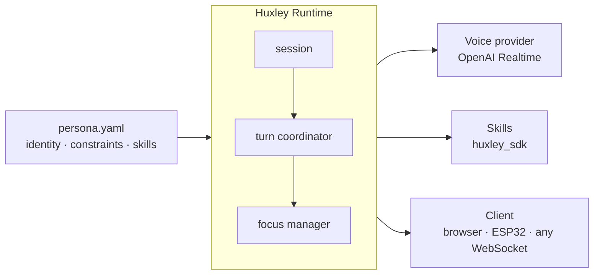

# Huxley

**An open-source framework for building real-time voice AI agents you actually own.**

You bring a **persona** (YAML — name, voice, language, constraints, skill list) and **skills** (Python packages). Huxley handles audio I/O, turn sequencing, interrupts, proactive speech, and audio bridging.

> **Status:** pre-1.0 — runs end-to-end, AbuelOS persona in daily use.

## Quick start

```bash
git clone https://github.com/ma-r-s/Huxley.git && cd Huxley
echo "HUXLEY_OPENAI_API_KEY=sk-..." > server/runtime/.env
uv sync && cd server/runtime && uv run huxley   # terminal 1
cd clients/pwa && bun install && bun dev         # terminal 2
```

Open [http://localhost:5174](http://localhost:5174), hold the button, speak.

## What Huxley handles

- **Turn coordination** — one audio channel, strict sequencing; interrupts are atomic (drop → flush → cancel)
- **Proactive speech** — skills fire turns without user input (`ctx.inject_turn()`)
- **Audio bridging** — skills claim mic + speaker for full-duplex use (calls, voice memos, any external audio)
- **Persona-as-config** — swap `persona.yaml`, get a different agent; no code change required
- **Behavioral constraints** — personas declare `never_say_no`, `confirm_destructive`, etc.; skills opt in

## Architecture



## Shipped skills

| Skill                     | What it does                                                            |
| ------------------------- | ----------------------------------------------------------------------- |
| `huxley-skill-audiobooks` | Local `.m4b`/`.mp3` library — pause, resume, rewind, position persisted |
| `huxley-skill-radio`      | HTTP/Icecast radio via ffmpeg, buffered with auto-reconnect             |
| `huxley-skill-news`       | Weather (Open-Meteo) + headlines (Google News RSS), cached              |
| `huxley-skill-search`     | DuckDuckGo web search, no API key needed                                |
| `huxley-skill-timers`     | One-shot and recurring reminders, SQLite-persisted                      |
| `huxley-skill-reminders`  | Scheduled reminders with retry escalation                               |
| `huxley-skill-system`     | Volume control, current time                                            |
| `huxley-skill-telegram`   | Full-duplex voice calls + text messages via Telegram                    |

Third-party skills install from PyPI and enable with one line in `persona.yaml`.

## Writing a skill

Skills are Python packages registered via entry points:

```python
from huxley_sdk import Skill, ToolDefinition, ToolResult, SkillContext

class LightsSkill:
    @property
    def name(self) -> str: return "lights"

    @property
    def tools(self) -> list[ToolDefinition]:
        return [ToolDefinition(
            name="set_lights",
            description="Turn the lights on or off.",
            parameters={"type": "object", "properties": {"on": {"type": "boolean"}}, "required": ["on"]},
        )]

    async def setup(self, ctx: SkillContext) -> None:
        self._api_key = ctx.config["api_key"]

    async def handle(self, tool_name: str, args: dict) -> ToolResult:
        return ToolResult(output='{"ok": true}')

    async def teardown(self) -> None: ...
```

```toml
# pyproject.toml
[project.entry-points."huxley.skills"]
lights = "my_package.skill:LightsSkill"
```

Enable in `persona.yaml`:

```yaml
skills:
  lights:
    api_key: "..."
```

Full guide: [docs/skills/README.md](./docs/skills/README.md)

## Requirements

- Python 3.13+
- [uv](https://docs.astral.sh/uv/)
- [bun](https://bun.sh) (dev client only)
- `ffmpeg` on PATH (radio and Telegram skills)
- OpenAI API key with Realtime API access

## Development

```bash
uv sync --all-packages
uv run ruff check server/ && uv run mypy server/sdk/src server/runtime/src
uv run pytest server/
cd clients/pwa && bun run check
```

## Docs

Full documentation at [huxley.ma-r-s.com/docs](https://huxley.ma-r-s.com/docs) — architecture, SDK reference, persona guide, wire protocol, observability, and roadmap.

---

MIT License
