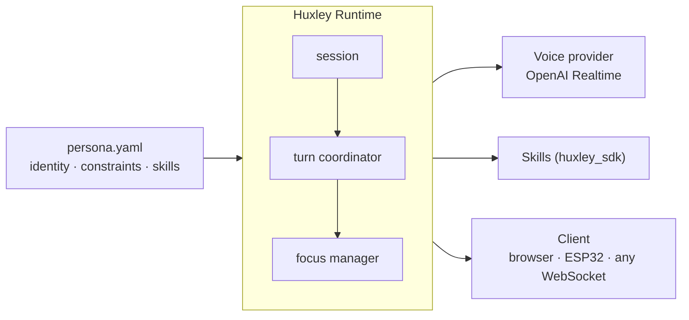

# Huxley

**A framework for composable, self-hosted voice AI agents — bring a persona YAML and Python skills; Huxley handles the rest.**

## Quick start

**Terminal 1 — server:**

```bash
git clone https://github.com/ma-r-s/Huxley.git && cd Huxley
echo "HUXLEY_OPENAI_API_KEY=sk-..." > server/runtime/.env
uv sync && cd server/runtime && uv run huxley
```

**Terminal 2 — browser client:**

```bash
cd clients/pwa && bun install && bun dev
```

Open [http://localhost:5174](http://localhost:5174), hold the button, speak.

## What Huxley handles

- **Persona-as-config** — swap `persona.yaml`, get a different agent; voice, language, personality, skill list, all in one file
- **Behavioral constraints** — personas declare `never_say_no`, `confirm_destructive`, etc.; skills opt in to respecting them
- **Turn coordination** — one audio channel, strict sequencing; mid-sentence interrupts handled correctly, no audio artifacts
- **Proactive speech** — skills fire turns without user input (`ctx.inject_turn()`)
- **Audio bridging** — skills claim mic + speaker for full-duplex use (calls, voice memos, any external audio)

## Architecture



> Skills and the voice provider never communicate directly — all routing goes through the runtime. The focus manager prevents audio collisions between model speech, skill audio streams, and full-duplex input claims.

## Shipped skills

| Skill                     | What it does                                                            |
| ------------------------- | ----------------------------------------------------------------------- |
| `huxley-skill-audiobooks` | Local `.m4b`/`.mp3` library — pause, resume, rewind, position persisted |
| `huxley-skill-radio`      | HTTP/Icecast radio via ffmpeg, buffered with auto-reconnect             |
| `huxley-skill-news`       | Weather (Open-Meteo) + headlines (Google News RSS), cached              |
| `huxley-skill-search`     | DuckDuckGo web search, no API key needed                                |
| `huxley-skill-timers`     | Countdown timers (relative — "in 10 minutes"), SQLite-persisted         |
| `huxley-skill-reminders`  | Calendar-time reminders with retry escalation if unacknowledged         |
| `huxley-skill-system`     | Volume control, current time                                            |
| `huxley-skill-telegram`   | Full-duplex voice calls + text messages via Telegram                    |

Third-party skills install from PyPI and enable with one line in `persona.yaml`.

## Writing a skill

Skills are Python packages registered via entry points. The framework never imports skill code directly — it loads them at startup through `huxley.skills` entry points.

```python
from huxley_sdk import ToolDefinition, ToolResult, SkillContext

class LightsSkill:
    @property
    def name(self) -> str: return "lights"

    @property
    def tools(self) -> list[ToolDefinition]:
        return [ToolDefinition(
            name="set_lights",
            description="Turn the lights on or off.",
            parameters={"type": "object", "properties": {"on": {"type": "boolean"}}, "required": ["on"]},
        )]

    async def setup(self, ctx: SkillContext) -> None:
        self._api_key = ctx.config["api_key"]

    async def handle(self, tool_name: str, args: dict) -> ToolResult:
        on = args["on"]
        await call_lights_api(self._api_key, on)
        return ToolResult(output="Lights turned on." if on else "Lights turned off.")

    async def teardown(self) -> None: ...
```

`ToolResult.output` is a string the voice model reads aloud — what the agent says after using the tool.

```toml
# pyproject.toml
[project.entry-points."huxley.skills"]
lights = "my_package.skill:LightsSkill"
```

Enable in `persona.yaml`:

```yaml
skills:
  lights:
    api_key: "..."
```

Full guide: [docs/skills/README.md](./docs/skills/README.md)

## Requirements

- Python 3.13+
- [uv](https://docs.astral.sh/uv/)
- [bun](https://bun.sh) (dev client only)
- [ffmpeg](https://ffmpeg.org/download.html) on PATH (radio and Telegram skills)
- OpenAI API key with Realtime API access

Linux and macOS supported. Windows untested.

## Contributing

```bash
uv sync --all-packages
uv run ruff check server/ && uv run mypy server/sdk/src server/runtime/src
uv run pytest server/
cd clients/pwa && bun run check
```

## Docs

Full documentation at [huxley.ma-r-s.com/docs](https://huxley.ma-r-s.com/docs) — architecture, SDK reference, persona guide, wire protocol, observability, and roadmap.

---

MIT License · pre-1.0 — runs end-to-end, in daily use
