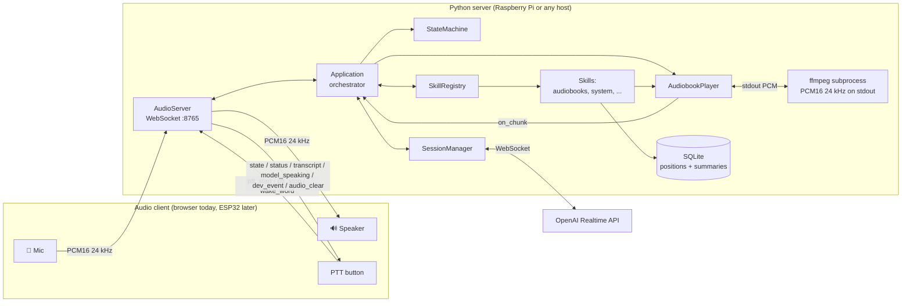
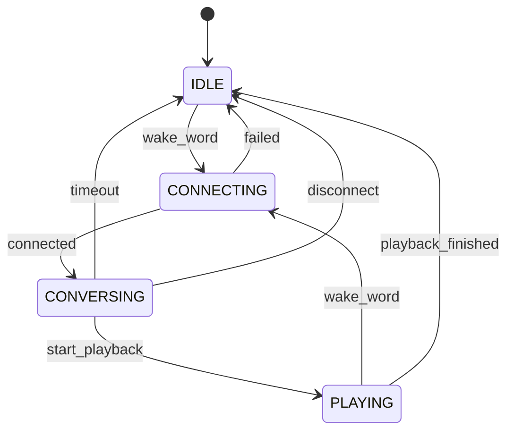
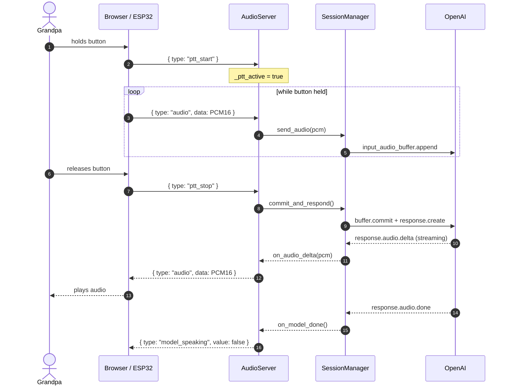
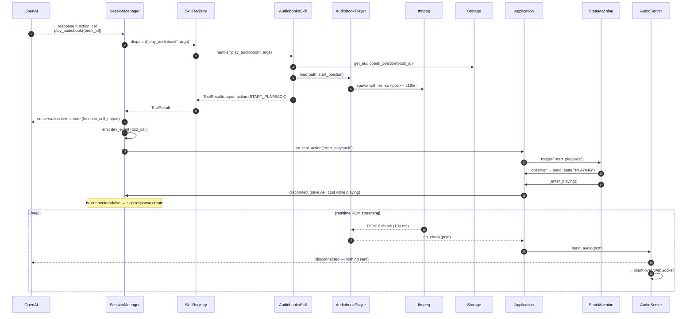
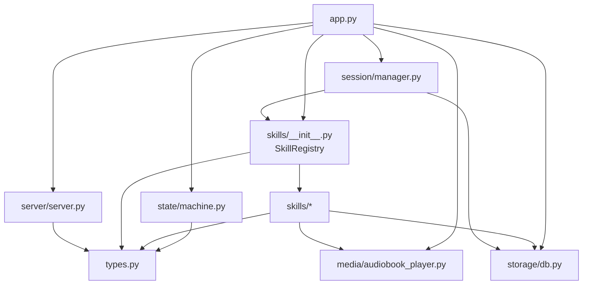

# Architecture

## System overview

**Audio path invariant**: there is **one** audio channel out to the client (`server.send_audio`). Both OpenAI model audio AND audiobook audio flow through it, in the exact same PCM16 24 kHz mono format. The client has one playback code path and cannot tell the two sources apart. See [decision 2026-04-13 — Audiobook audio streams through the WebSocket](./decisions.md#2026-04-13--audiobook-audio-streams-through-the-websocket-not-local-playback).

> **Note (design in flight)**: the audio path is being refactored from one shared `send_audio` channel into **named channels** (`speech`, `media`, `tone`, `status`) coordinated by a turn-based scheduler. This resolves a class of ordering bugs around tool-call side effects and model speech racing each other. The full spec is [`turns.md`](./turns.md) and the corresponding ADR is [decision 2026-04-13 — Turn-based coordinator for voice tool calls](./decisions.md#2026-04-13--turn-based-coordinator-for-voice-tool-calls). Until that refactor lands, the "single send_audio channel" invariant above still describes the runtime.

## Core rule — the client owns audio, the server owns the brain

Python never touches audio hardware. Every audio client — browser for dev, ESP32 for production — captures the mic, drives the speaker, and streams PCM16 at 24 kHz over WebSocket. The server relays audio to OpenAI, dispatches tool calls, runs skills, and manages state. This is why the same server code works for the browser and will work for the ESP32 walky-talky without re-architecture.

See [decision 2026-04-12 — Python server does not own audio hardware](./decisions.md#2026-04-12--python-server-does-not-own-audio-hardware).

## State machine

- **IDLE** — no OpenAI session, no playback. Resting state.
- **CONNECTING** — opening the WebSocket to OpenAI, sending `session.update` with tool schemas.
- **CONVERSING** — session open, PTT works, tool calls dispatch.
- **PLAYING** — `AudiobookPlayer` is streaming PCM through `server.send_audio` to the client; the OpenAI session is **disconnected** to save API cost. Pressing the button re-enters CONNECTING (and `_exit_playing` stops the player + saves position first).

The transition table lives in [`server/src/abuel_os/state/machine.py`](../server/src/abuel_os/state/machine.py) — that file is the authoritative source. Any change to the table must update this diagram in the same commit.

## Sequence — a PTT turn in CONVERSING

## Sequence — a tool call that triggers playback

**Key insights**:

1. **A skill never touches the state machine or the session directly.** It returns a `ToolResult` with an `action` field. The Application observes the action and drives the state machine. Skills stay decoupled from session lifecycle.
2. **Side effects run BEFORE `response.create`.** `SessionManager` dispatches the tool, sends `function_call_output`, emits the `dev_event`, then runs the side effect (state transition). For terminal actions like `start_playback` the side effect disconnects the OpenAI session, so the subsequent `response.create` is skipped (guarded by `is_connected`). Without this ordering the server would ask a closed socket for a follow-up response.
3. **Audiobook audio rides the same `server.send_audio` channel** as model audio. The client's `AudioPlayback` handles both sources identically — zero conditional logic.

## Dependency flow (no cycles)

Dependencies flow **downward**. `types.py` is the universal leaf — everyone imports from it, it imports from nothing. `app.py` is the root — nothing imports from it, it wires everything.

## Where to look in code

| Concern                     | File                                            |
| --------------------------- | ----------------------------------------------- |
| Orchestrator / all wiring   | `server/src/abuel_os/app.py`                    |
| WebSocket audio server      | `server/src/abuel_os/server/server.py`          |
| State machine + transitions | `server/src/abuel_os/state/machine.py`          |
| OpenAI session lifecycle    | `server/src/abuel_os/session/manager.py`        |
| OpenAI event schemas        | `server/src/abuel_os/session/protocol.py`       |
| Skill registry + dispatch   | `server/src/abuel_os/skills/__init__.py`        |
| Skill protocol (structural) | `server/src/abuel_os/types.py`                  |
| Audiobooks skill            | `server/src/abuel_os/skills/audiobooks.py`      |
| Audiobook streaming player  | `server/src/abuel_os/media/audiobook_player.py` |
| SQLite wrapper              | `server/src/abuel_os/storage/db.py`             |
| Config (env + defaults)     | `server/src/abuel_os/config.py`                 |
