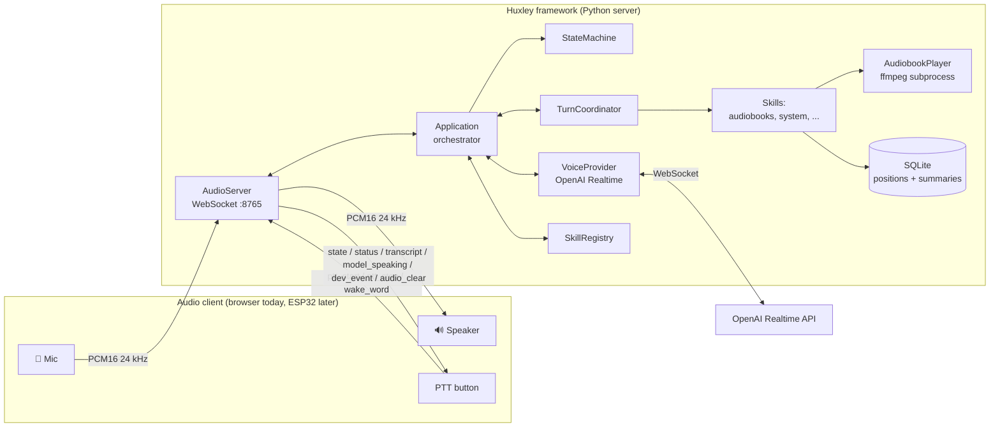
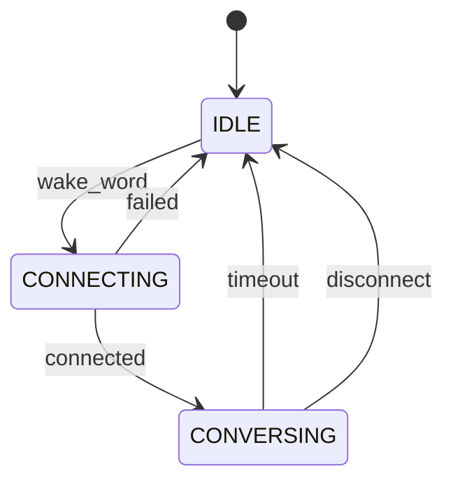
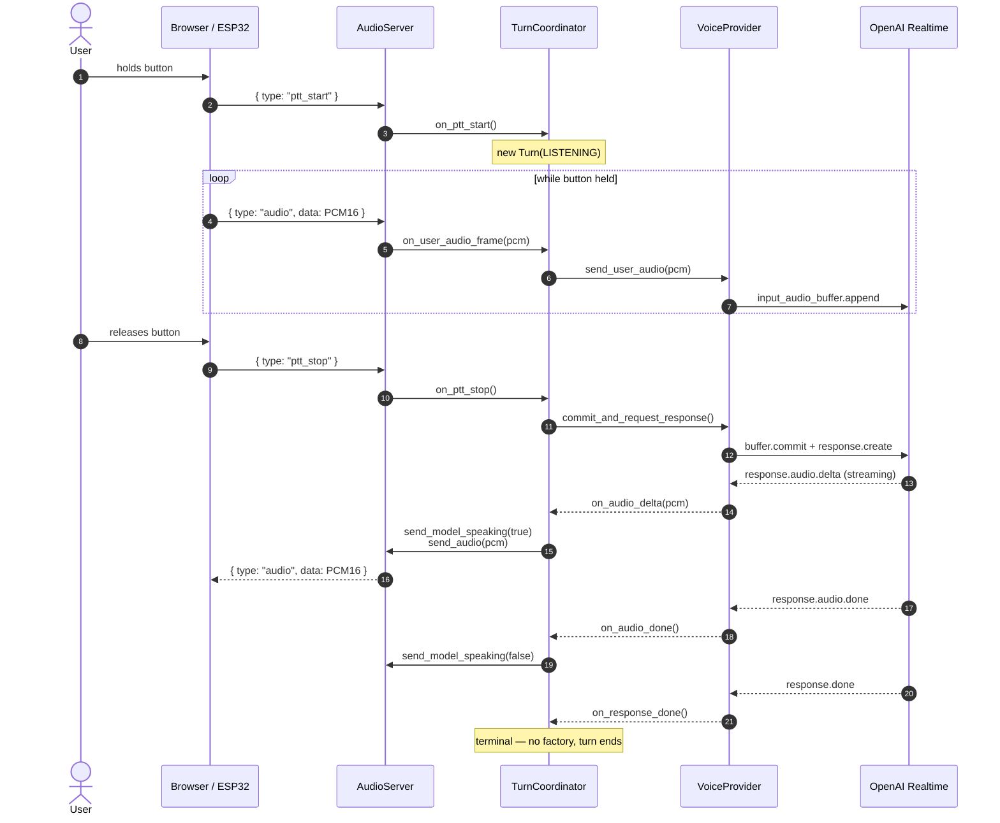
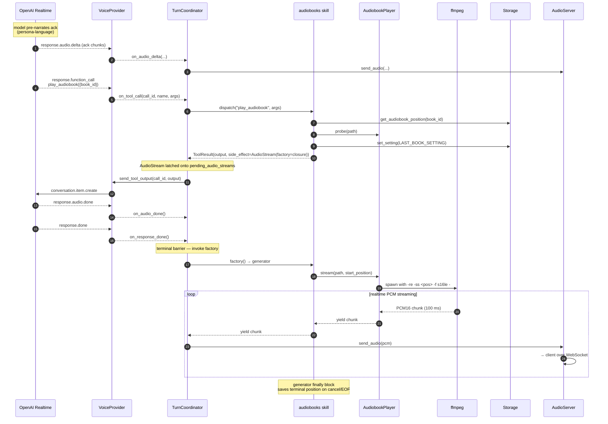
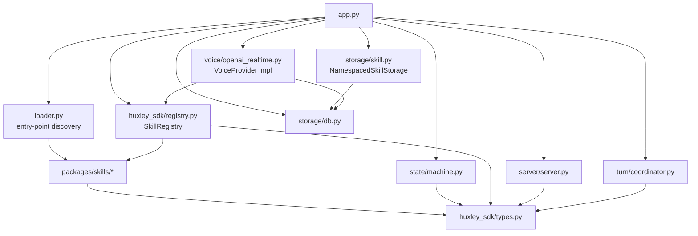

# Architecture

This is the architecture of **Huxley the framework** — the parts that are persona-agnostic and skill-agnostic. Persona spec lives in [`personas/`](./personas/), skill spec in [`skills/`](./skills/). Diagrams use the AbuelOS persona as the worked example because it's the canonical one, but the architecture is identical for any persona.

> **Refactor in progress**: stage 1 (rename + workspace + SDK extraction) shipped on 2026-04-16. The Python namespaces are now `huxley` (framework runtime, in `packages/core/`) and `huxley_sdk` (skill author surface, in `packages/sdk/`). Stages 2–5 add entry-point-loaded skill packages, persona YAML loading, and the persona-data move; until they land, the two skills (`audiobooks`, `system`) still live inside `packages/core/src/huxley/skills/` and are constructed inline in `app.py`. The plan lives in `~/.claude/plans/proud-conjuring-papert.md`.

## System overview



## Core invariants

### Audio path: client owns I/O, framework owns the brain

Huxley never touches audio hardware. Every client — browser for dev, ESP32 for production — captures the mic, drives the speaker, and streams PCM16 at 24 kHz over WebSocket. Huxley relays audio to the voice provider, dispatches tool calls, runs skills, manages state. This is why the same framework code works for any client without re-architecture.

See [decision 2026-04-12 — Python server does not own audio hardware](./decisions.md#2026-04-12--python-server-does-not-own-audio-hardware).

### One audio pipe out

There is **one** audio channel out to the client (`server.send_audio`). Both LLM model audio AND tool-produced audio (audiobook playback, future media) flow through it, in the exact same PCM16 24 kHz mono format. The client has one playback code path and cannot tell the two sources apart. The TurnCoordinator sequences them so model speech always comes before tool audio in the same turn.

See [decision 2026-04-13 — Audiobook audio streams through the WebSocket](./decisions.md#2026-04-13--audiobook-audio-streams-through-the-websocket-not-local-playback) and [`turns.md`](./turns.md).

### Persona is config, not code

The framework loads a `persona.yaml` at startup and uses it to build the system prompt, register the listed skills, and configure the voice provider. Swap the persona file → swap the agent. Code does not know "this is for a blind elderly user" — that knowledge lives entirely in the persona file and the constraint definitions it references.

## State machine

The session-level state machine has 3 states:



- **IDLE** — no voice provider session. Resting state.
- **CONNECTING** — opening the session, sending `session.update` with tool schemas.
- **CONVERSING** — session open, PTT works, tool calls dispatch, audiobook playback may be happening — media is orthogonal to session state.

Media playback is **not** a session state. It's tracked by the coordinator's current `ContentStreamObserver`, which outlives turns: a book started in turn N keeps playing until turn N+M interrupts it. The voice provider session stays open during book playback (idle sessions cost zero tokens), and pressing PTT mid-book goes through the turn coordinator's interrupt method rather than a state transition.

See [`turns.md`](./turns.md) and [decision 2026-04-13 — Turn-based coordinator for voice tool calls](./decisions.md#2026-04-13--turn-based-coordinator-for-voice-tool-calls).

## Sequence — a PTT turn in CONVERSING



## Sequence — a tool call that starts an audiobook



**Key insights**:

1. **A skill never touches the coordinator, state machine, or the voice provider directly.** It returns a `ToolResult` with an optional `side_effect` (today: `AudioStream(factory=...)`; future kinds reuse the same shape). The framework executes side effects at the right moment.
2. **Speech before factories, always.** The coordinator forwards the model's audio deltas first, then invokes pending factories on `response.done`. Tool audio never jumps in without an ack — structurally impossible, not "fixed with a flag."
3. **Same audio pipe for everything.** Model speech and tool audio both travel through `server.send_audio`. The client doesn't branch on source.
4. **Atomic interrupts.** A new `ptt_start` during a live turn runs `coordinator.interrupt()`: drop flag → clear pending factories → audio_clear → cancel media task → cancel LLM response → mark turn interrupted. The running media task's `finally` block persists any terminal state (e.g. audiobook position), so seek/forward/interrupt are all transaction-safe without eager storage writes.

## Turn coordinator internals

The `TurnCoordinator` orchestrates a single user-assistant exchange. State
lives in five collaborators — each one owns a single axis of responsibility
so the I/O-plane primitives (T1.4) slot into existing seams instead of
reshaping the coordinator:

- **`TurnFactory`** creates every `Turn` instance, tagged with `TurnSource`
  (`USER`, `COMPLETION`, `INJECTED`). `INJECTED` is reserved for the
  `inject_turn` primitive.
- **`MicRouter`** is the sole destination for mic PCM. The voice provider
  is today's only handler; `InputClaim` will install short-lived claims
  through the same `claim()/release()` API.
- **`SpeakingState`** tracks who currently owns the speaker — one of
  `user | factory | completion | injected | claim | None`. The named-owner
  shape replaces the boolean flag that used to be flipped at six call
  sites; `release(expected)` is a safe no-op when something else has taken
  over.
- **`ContentStreamObserver`** wraps the single running audio-stream
  `asyncio.Task`. It implements the focus-management `ChannelObserver`
  protocol — the coordinator drives it directly today (`FOREGROUND/PRIMARY`
  on start, `NONE/MUST_STOP` on stop); a `FocusManager` mediates the same
  transitions when skill-level arbitration lands.
- **`FocusManager`** (shipped, not yet wired into the coordinator) is the
  serialized arbitrator over the speaker. It manages Activity stacks per
  channel (`DIALOG`, `COMMS`, `ALERT`, `CONTENT`), delivers
  `(FocusState, MixingBehavior)` transitions to observers, and enforces
  single-task mutation via the actor pattern. See
  `docs/architecture.md#focus-management` for the channel model.

See `docs/io-plane.md` for the primitives these collaborators will support
and `docs/turns.md` for the turn state machine they orchestrate.

### Authority contract — `SpeakingState` vs `FocusManager`

Two overlapping-but-distinct concerns live side by side. To prevent drift, the split is explicit:

**`SpeakingState` is authoritative for "should the client show a speaking indicator right now."** It tracks actual audio flow out the WebSocket. Its `notify(bool)` callback fires the `model_speaking` wire event that drives the client's UI and silence-timer gating. Writes happen on concrete audio-bearing events:

- `acquire(owner)` when the first audio chunk of a turn actually lands (first `on_audio_delta`, or first chunk of a content-stream pump)
- `force_release()` on `on_audio_done`, `interrupt()`, `on_session_disconnected`
- `transfer(from, to)` when a stream hands ownership to a synthetic follow-up turn (e.g. FACTORY → COMPLETION at `_maybe_fire_completion_prompt`) — no notify fires; the client is still seeing `model_speaking=true`, only the internal owner label changes

**`FocusManager` is authoritative for "who has claimed the speaker resource."** A channel `Activity` being FOREGROUND means "this activity holds the right to speak," which is a _logical_ claim — it can precede actual audio by hundreds of milliseconds (first-token latency on the LLM, subprocess spawn on a content stream). Writes happen on claim lifecycle events:

- `acquire(activity)` when a skill or the coordinator registers an intent to speak
- `release(channel, interface_name)` on clean end
- `stop_foreground()` / `stop()` on barrier events
- patience expiry, preemption, same-interface replacement — all mailbox-driven

**The invariant** (maintained by the coordinator, not the framework): every transition of `FocusManager`-delivered FocusState for a DIALOG or CONTENT channel corresponds to exactly one matched transition of `SpeakingState` — but _not necessarily at the same instant_. The coordinator owns the bridge:

| FocusManager event                                    | Coordinator response       | SpeakingState write                                        |
| ----------------------------------------------------- | -------------------------- | ---------------------------------------------------------- |
| DIALOG → FOREGROUND (user turn starts)                | wait for first audio delta | on first delta: `acquire(USER)`                            |
| DIALOG → NONE (turn interrupted / ends)               | stop consuming model audio | `force_release()` (idempotent — may already be clear)      |
| CONTENT → FOREGROUND (stream starts)                  | spawn pump                 | on first chunk: `acquire(FACTORY)`                         |
| CONTENT → BACKGROUND/MAY_DUCK                         | ramp gain (no pause)       | no change; factory still speaking                          |
| CONTENT → BACKGROUND/MUST_PAUSE                       | cancel pump                | `release(FACTORY)` if owned                                |
| CONTENT → NONE                                        | cancel pump, clean up      | `release(FACTORY)` if owned                                |
| DIALOG preempts CONTENT (completion follow-up prompt) | synthesize COMPLETION turn | `transfer(FACTORY → COMPLETION)` — no notify, same speaker |

**Consequences for callers:**

- Skills never touch `SpeakingState`. It's a framework-internal artifact of the audio pipeline.
- Skills describe their intent via `SideEffect` types (`AudioStream`, future `InputClaim`); the framework translates to `FocusManager` events and, as audio actually flows, updates `SpeakingState`.
- Tests can assert on either — `FocusManager` state for "did this claim land," `SpeakingState` for "did the user hear audio" — but never on both as if they're the same thing.

**When they disagree** (a turn holds DIALOG FOREGROUND but no audio has flowed yet, or a stream pumped one chunk then was preempted before `release` fired), `SpeakingState` is what the client sees. `FocusManager` is what the framework knows. Reconciliation happens at the next barrier (`interrupt()`, `on_session_disconnected`, natural response-done).

This contract is load-bearing for T1.4 Stage 1c onward. Any future primitive that speaks (inject_turn, InputClaim with `speaker_source`) must name explicitly which of the two it's writing to, and the framework bridges the rest.

## Dependency flow (no cycles)



Dependencies flow **downward**. `huxley_sdk/types.py` is the universal leaf — everyone imports from it, it imports from nothing. `app.py` is the root — nothing imports from it, it wires everything. Skill packages depend only on `huxley_sdk`, never on framework internals; the framework reaches them only through entry-point discovery and the `Skill` protocol. This is the boundary that makes third-party skills possible.

## Where to look in code

| Concern                           | File                                                               |
| --------------------------------- | ------------------------------------------------------------------ |
| Orchestrator / all wiring         | `packages/core/src/huxley/app.py`                                  |
| WebSocket audio server            | `packages/core/src/huxley/server/server.py`                        |
| State machine + transitions       | `packages/core/src/huxley/state/machine.py`                        |
| Turn coordinator + factory fire   | `packages/core/src/huxley/turn/coordinator.py`                     |
| Turn vocabulary (`Turn`, states)  | `packages/core/src/huxley/turn/state.py`                           |
| `TurnFactory`                     | `packages/core/src/huxley/turn/factory.py`                         |
| `MicRouter` (mic-frame dispatch)  | `packages/core/src/huxley/turn/mic_router.py`                      |
| `SpeakingState` (speaker owner)   | `packages/core/src/huxley/turn/speaking_state.py`                  |
| Turn observers (Dialog, Content)  | `packages/core/src/huxley/turn/observers.py`                       |
| `FocusManager` + actor loop       | `packages/core/src/huxley/focus/manager.py`                        |
| Focus vocabulary (Channel, State) | `packages/core/src/huxley/focus/vocabulary.py`                     |
| VoiceProvider protocol            | `packages/core/src/huxley/voice/provider.py`                       |
| OpenAI Realtime implementation    | `packages/core/src/huxley/voice/openai_realtime.py`                |
| OpenAI event schemas              | `packages/core/src/huxley/voice/openai_protocol.py`                |
| StubVoiceProvider (for tests)     | `packages/core/src/huxley/voice/stub.py`                           |
| Skill protocol + ToolResult       | `packages/sdk/src/huxley_sdk/types.py`                             |
| Skill registry + dispatch         | `packages/sdk/src/huxley_sdk/registry.py`                          |
| SkillContext + SkillStorage       | `packages/sdk/src/huxley_sdk/types.py`                             |
| FakeSkill (test helper)           | `packages/sdk/src/huxley_sdk/testing.py`                           |
| Skill loader (entry points)       | `packages/core/src/huxley/loader.py`                               |
| Audiobooks skill                  | `packages/skills/audiobooks/src/huxley_skill_audiobooks/skill.py`  |
| Audiobook ffmpeg stream generator | `packages/skills/audiobooks/src/huxley_skill_audiobooks/player.py` |
| System skill                      | `packages/skills/system/src/huxley_skill_system/skill.py`          |
| SQLite wrapper                    | `packages/core/src/huxley/storage/db.py`                           |
| Per-skill namespaced KV adapter   | `packages/core/src/huxley/storage/skill.py`                        |
| Config (env-driven settings)      | `packages/core/src/huxley/config.py`                               |

After stage 4 lands, persona-driven configuration takes over:

```
personas/abuelos/persona.yaml   # the AbuelOS persona spec
personas/abuelos/data/          # audiobooks library + sqlite db
```
