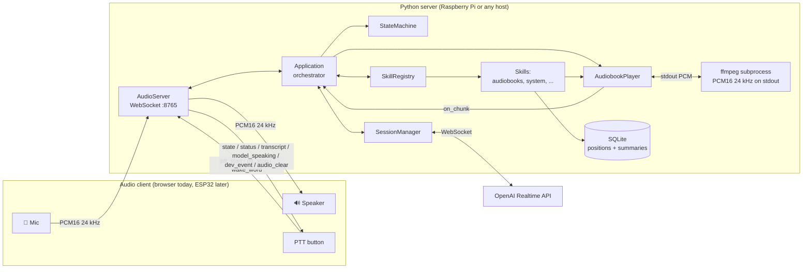
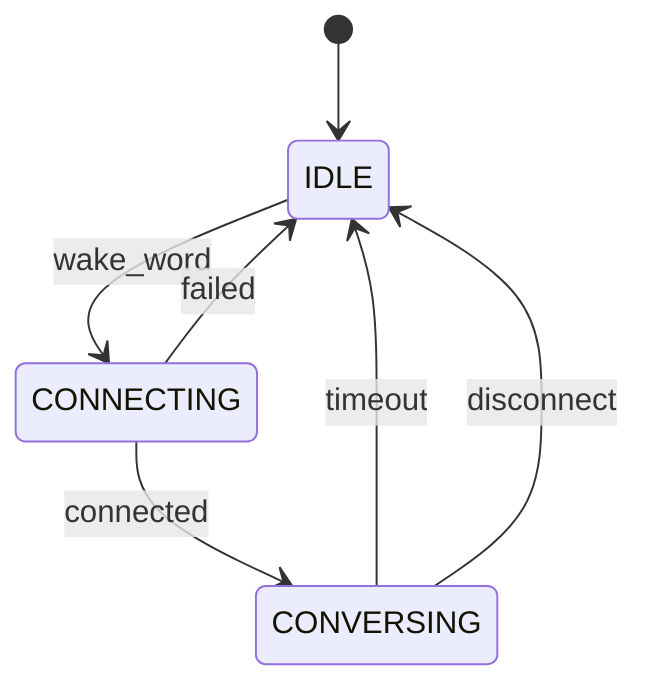
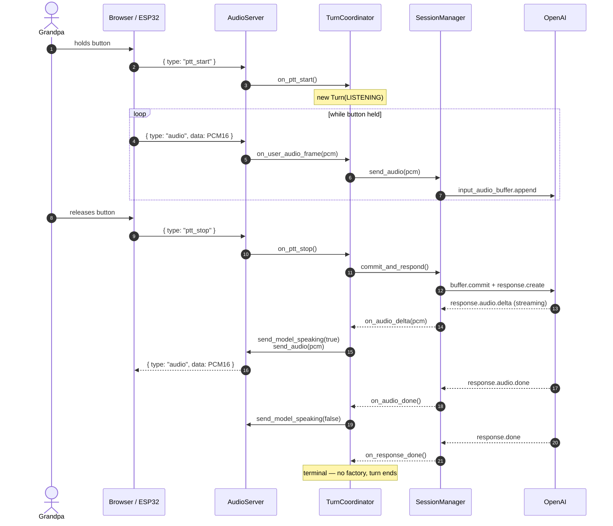
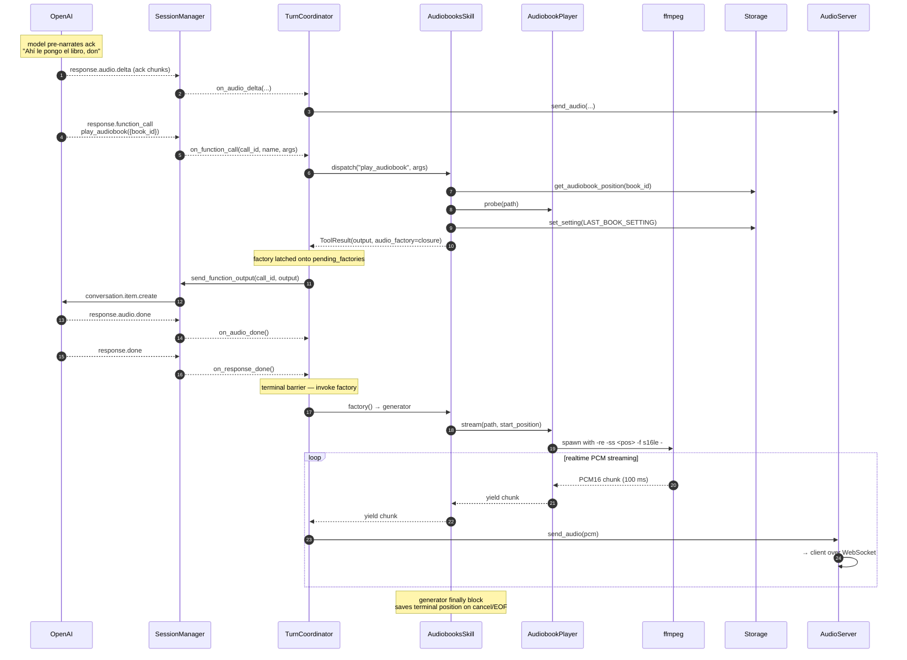
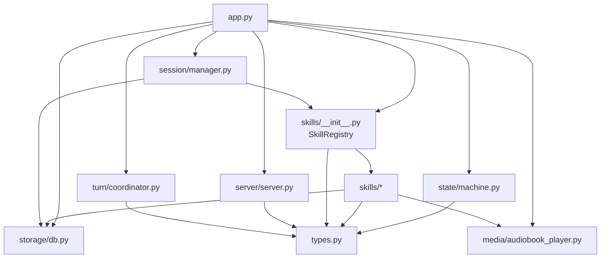

# Architecture

## System overview

**Audio path invariant**: there is **one** audio channel out to the client (`server.send_audio`). Both OpenAI model audio AND audiobook audio flow through it, in the exact same PCM16 24 kHz mono format. The client has one playback code path and cannot tell the two sources apart. See [decision 2026-04-13 — Audiobook audio streams through the WebSocket](./decisions.md#2026-04-13--audiobook-audio-streams-through-the-websocket-not-local-playback).

> **Note (design in flight)**: the audio path is being refactored from one shared `send_audio` channel into **named channels** (`speech`, `media`, `tone`, `status`) coordinated by a turn-based scheduler. This resolves a class of ordering bugs around tool-call side effects and model speech racing each other. The full spec is [`turns.md`](./turns.md) and the corresponding ADR is [decision 2026-04-13 — Turn-based coordinator for voice tool calls](./decisions.md#2026-04-13--turn-based-coordinator-for-voice-tool-calls). Until that refactor lands, the "single send_audio channel" invariant above still describes the runtime.

## Core rule — the client owns audio, the server owns the brain

Python never touches audio hardware. Every audio client — browser for dev, ESP32 for production — captures the mic, drives the speaker, and streams PCM16 at 24 kHz over WebSocket. The server relays audio to OpenAI, dispatches tool calls, runs skills, and manages state. This is why the same server code works for the browser and will work for the ESP32 walky-talky without re-architecture.

See [decision 2026-04-12 — Python server does not own audio hardware](./decisions.md#2026-04-12--python-server-does-not-own-audio-hardware).

## State machine

- **IDLE** — no OpenAI session. Resting state.
- **CONNECTING** — opening the WebSocket to OpenAI, sending `session.update` with tool schemas.
- **CONVERSING** — session open, PTT works, tool calls dispatch, audiobook playback is happening (or not) — media is orthogonal to session state.

Media playback is **not** a session state. It's tracked by `TurnCoordinator.current_media_task`, which outlives turns: a book started in turn N keeps playing until turn N+M interrupts it. The OpenAI session stays open during book playback (idle sessions cost zero tokens), and pressing PTT mid-book goes through the turn coordinator's interrupt method rather than a state transition. See [`turns.md`](./turns.md#7-session-vs-turn-lifetime--playing-state-removed) and [decision 2026-04-13 — Turn-based coordinator for voice tool calls](./decisions.md#2026-04-13--turn-based-coordinator-for-voice-tool-calls).

The transition table lives in [`server/src/abuel_os/state/machine.py`](../server/src/abuel_os/state/machine.py) — that file is the authoritative source. Any change to the table must update this diagram in the same commit.

## Sequence — a PTT turn in CONVERSING

## Sequence — a tool call that starts an audiobook

**Key insights**:

1. **A skill never touches the coordinator, state machine, or the session directly.** It returns a `ToolResult` with an optional `audio_factory` closure. The coordinator invokes the factory at the turn's terminal barrier, after the model finishes speaking.
2. **Speech before factories, always.** The coordinator forwards the model's audio deltas first, then invokes pending factories on `response.done`. The book never jumps in without an ack — structurally impossible, not "fixed with a flag."
3. **Same audio pipe for everything.** Model speech and book PCM both travel through `server.send_audio`. The client's `AudioPlayback` doesn't branch on source.
4. **Atomic interrupts.** A new `ptt_start` during a live turn runs `coordinator.interrupt()`: drop flag → clear pending factories → audio_clear → cancel media task → cancel OpenAI response → mark turn interrupted. The running media task's `finally` block persists the terminal position, so rewind/forward/interrupt are all transaction-safe without eager storage writes.

## Dependency flow (no cycles)

Dependencies flow **downward**. `types.py` is the universal leaf — everyone imports from it, it imports from nothing. `app.py` is the root — nothing imports from it, it wires everything.

## Where to look in code

| Concern                           | File                                            |
| --------------------------------- | ----------------------------------------------- |
| Orchestrator / all wiring         | `server/src/abuel_os/app.py`                    |
| WebSocket audio server            | `server/src/abuel_os/server/server.py`          |
| State machine + transitions       | `server/src/abuel_os/state/machine.py`          |
| Turn coordinator + factory fire   | `server/src/abuel_os/turn/coordinator.py`       |
| OpenAI session lifecycle          | `server/src/abuel_os/session/manager.py`        |
| OpenAI event schemas              | `server/src/abuel_os/session/protocol.py`       |
| Skill registry + dispatch         | `server/src/abuel_os/skills/__init__.py`        |
| Skill protocol + ToolResult       | `server/src/abuel_os/types.py`                  |
| Audiobooks skill                  | `server/src/abuel_os/skills/audiobooks.py`      |
| Audiobook ffmpeg stream generator | `server/src/abuel_os/media/audiobook_player.py` |
| SQLite wrapper                    | `server/src/abuel_os/storage/db.py`             |
| Config (env + defaults)           | `server/src/abuel_os/config.py`                 |
