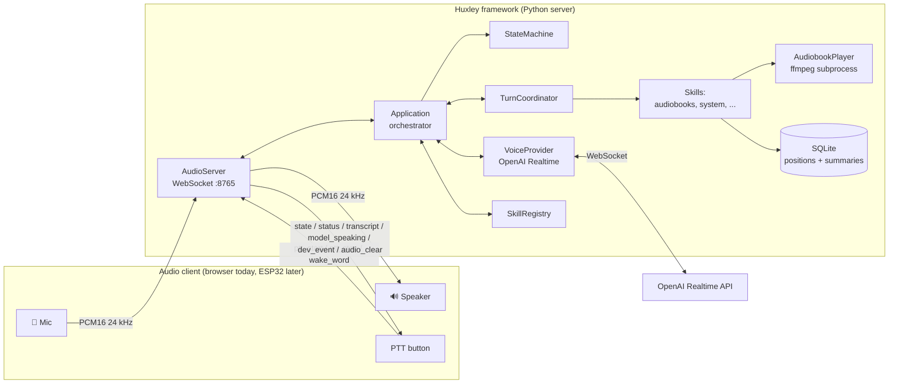
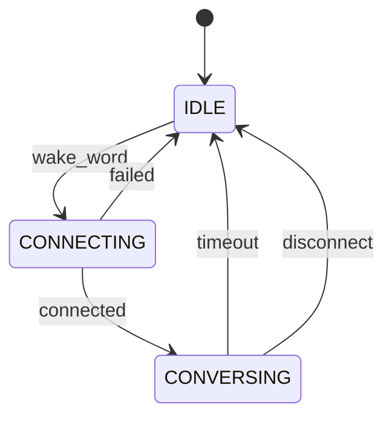
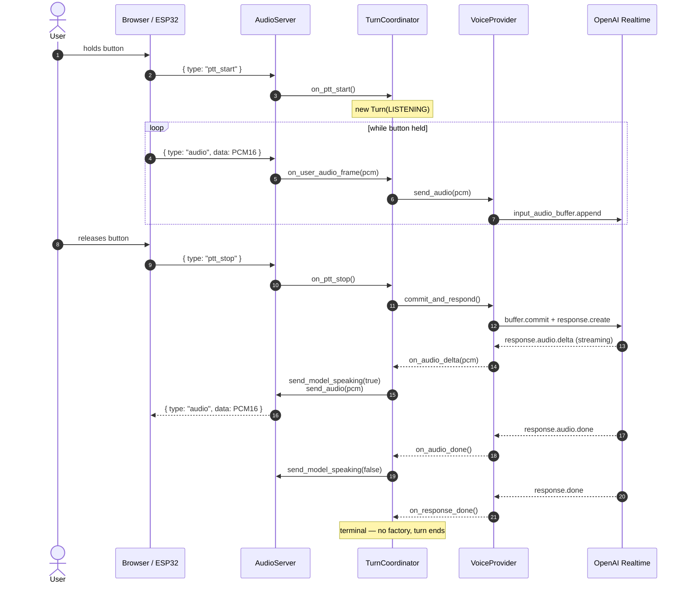
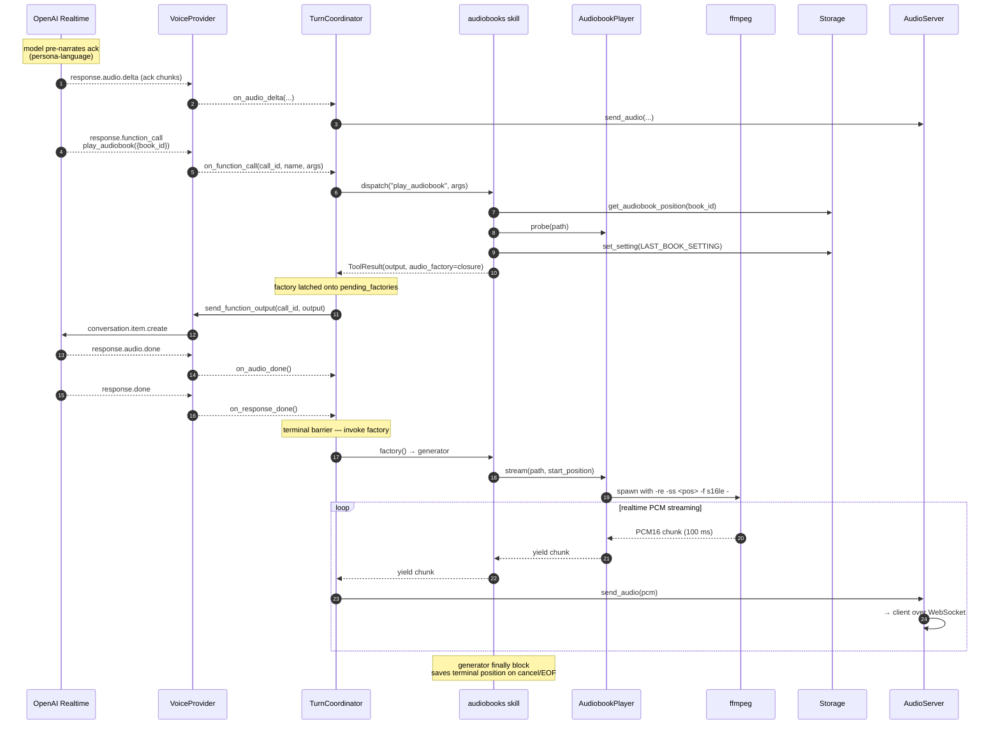
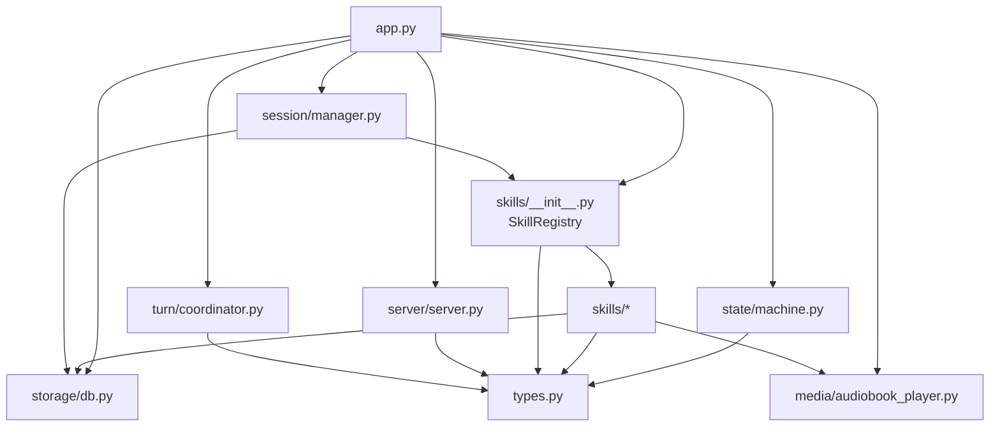

# Architecture

This is the architecture of **Huxley the framework** — the parts that are persona-agnostic and skill-agnostic. Persona spec lives in [`personas/`](./personas/), skill spec in [`skills/`](./skills/). Diagrams use the AbuelOS persona as the worked example because it's the canonical one, but the architecture is identical for any persona.

> **Code-vs-docs note**: the framework's Python namespace is currently `abuel_os` and lives in `server/src/abuel_os/`. The rename to `huxley` (and split into `packages/sdk/` + `packages/core/`) is the next refactor. Documentation refers to "Huxley" as the framework name; code references still use `abuel_os` until the refactor lands.

## System overview



## Core invariants

### Audio path: client owns I/O, framework owns the brain

Huxley never touches audio hardware. Every client — browser for dev, ESP32 for production — captures the mic, drives the speaker, and streams PCM16 at 24 kHz over WebSocket. Huxley relays audio to the voice provider, dispatches tool calls, runs skills, manages state. This is why the same framework code works for any client without re-architecture.

See [decision 2026-04-12 — Python server does not own audio hardware](./decisions.md#2026-04-12--python-server-does-not-own-audio-hardware).

### One audio pipe out

There is **one** audio channel out to the client (`server.send_audio`). Both LLM model audio AND tool-produced audio (audiobook playback, future media) flow through it, in the exact same PCM16 24 kHz mono format. The client has one playback code path and cannot tell the two sources apart. The TurnCoordinator sequences them so model speech always comes before tool audio in the same turn.

See [decision 2026-04-13 — Audiobook audio streams through the WebSocket](./decisions.md#2026-04-13--audiobook-audio-streams-through-the-websocket-not-local-playback) and [`turns.md`](./turns.md).

### Persona is config, not code

The framework loads a `persona.yaml` at startup and uses it to build the system prompt, register the listed skills, and configure the voice provider. Swap the persona file → swap the agent. Code does not know "this is for a blind grandpa" — that knowledge lives entirely in the persona file and the constraint definitions it references.

## State machine

The session-level state machine has 3 states:



- **IDLE** — no voice provider session. Resting state.
- **CONNECTING** — opening the session, sending `session.update` with tool schemas.
- **CONVERSING** — session open, PTT works, tool calls dispatch, audiobook playback may be happening — media is orthogonal to session state.

Media playback is **not** a session state. It's tracked by `TurnCoordinator.current_media_task`, which outlives turns: a book started in turn N keeps playing until turn N+M interrupts it. The voice provider session stays open during book playback (idle sessions cost zero tokens), and pressing PTT mid-book goes through the turn coordinator's interrupt method rather than a state transition.

See [`turns.md`](./turns.md) and [decision 2026-04-13 — Turn-based coordinator for voice tool calls](./decisions.md#2026-04-13--turn-based-coordinator-for-voice-tool-calls).

## Sequence — a PTT turn in CONVERSING



## Sequence — a tool call that starts an audiobook



**Key insights**:

1. **A skill never touches the coordinator, state machine, or the voice provider directly.** It returns a `ToolResult` with an optional `audio_factory` closure (or other side effect). The framework executes side effects at the right moment.
2. **Speech before factories, always.** The coordinator forwards the model's audio deltas first, then invokes pending factories on `response.done`. Tool audio never jumps in without an ack — structurally impossible, not "fixed with a flag."
3. **Same audio pipe for everything.** Model speech and tool audio both travel through `server.send_audio`. The client doesn't branch on source.
4. **Atomic interrupts.** A new `ptt_start` during a live turn runs `coordinator.interrupt()`: drop flag → clear pending factories → audio_clear → cancel media task → cancel LLM response → mark turn interrupted. The running media task's `finally` block persists any terminal state (e.g. audiobook position), so seek/forward/interrupt are all transaction-safe without eager storage writes.

## Dependency flow (no cycles)



Dependencies flow **downward**. `types.py` is the universal leaf — everyone imports from it, it imports from nothing. `app.py` is the root — nothing imports from it, it wires everything.

After the SDK extraction (next refactor), skills will depend only on `huxley_sdk`, never on framework internals. This is the boundary that makes third-party skills possible.

## Where to look in code

| Concern                           | File (current — pre-rename)                     |
| --------------------------------- | ----------------------------------------------- |
| Orchestrator / all wiring         | `server/src/abuel_os/app.py`                    |
| WebSocket audio server            | `server/src/abuel_os/server/server.py`          |
| State machine + transitions       | `server/src/abuel_os/state/machine.py`          |
| Turn coordinator + factory fire   | `server/src/abuel_os/turn/coordinator.py`       |
| Voice provider (OpenAI Realtime)  | `server/src/abuel_os/session/manager.py`        |
| OpenAI event schemas              | `server/src/abuel_os/session/protocol.py`       |
| Skill registry + dispatch         | `server/src/abuel_os/skills/__init__.py`        |
| Skill protocol + ToolResult       | `server/src/abuel_os/types.py`                  |
| Audiobooks skill                  | `server/src/abuel_os/skills/audiobooks.py`      |
| Audiobook ffmpeg stream generator | `server/src/abuel_os/media/audiobook_player.py` |
| SQLite wrapper                    | `server/src/abuel_os/storage/db.py`             |
| Config (env + defaults)           | `server/src/abuel_os/config.py`                 |

After the rename → split refactor, this table reorganizes into:

```
packages/core/src/huxley/...    # framework runtime
packages/sdk/src/huxley_sdk/... # skill author interface
packages/skills/audiobooks/...  # built-in audiobooks skill
packages/skills/system/...      # built-in system skill
personas/abuelos/persona.yaml   # the AbuelOS persona
```
