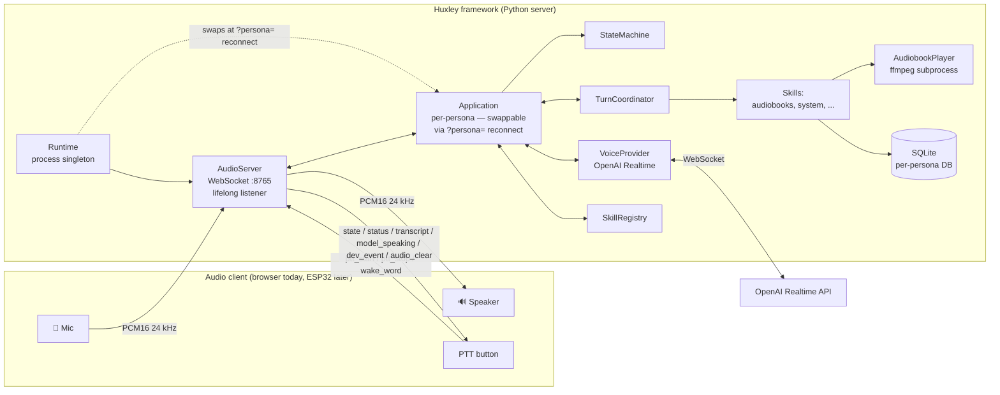
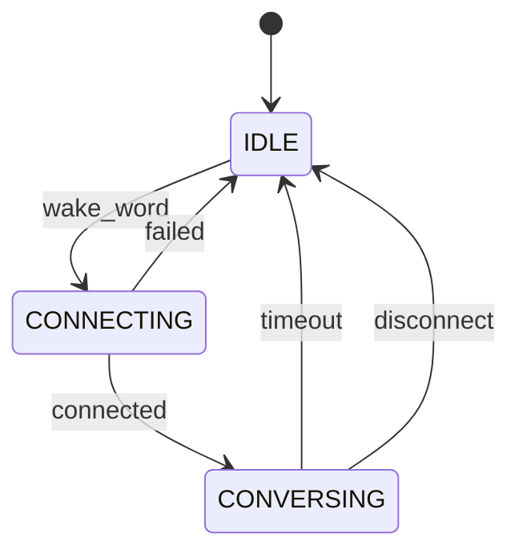
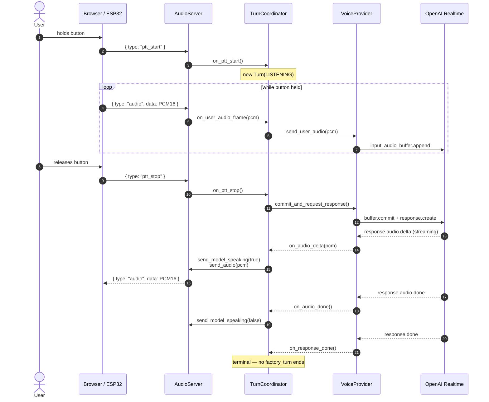
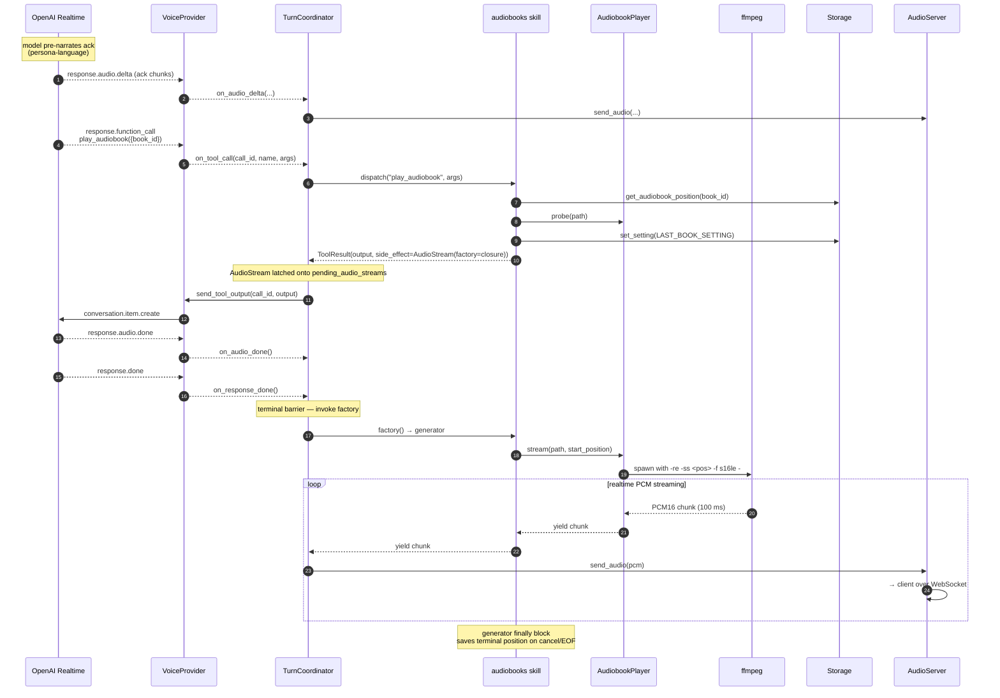
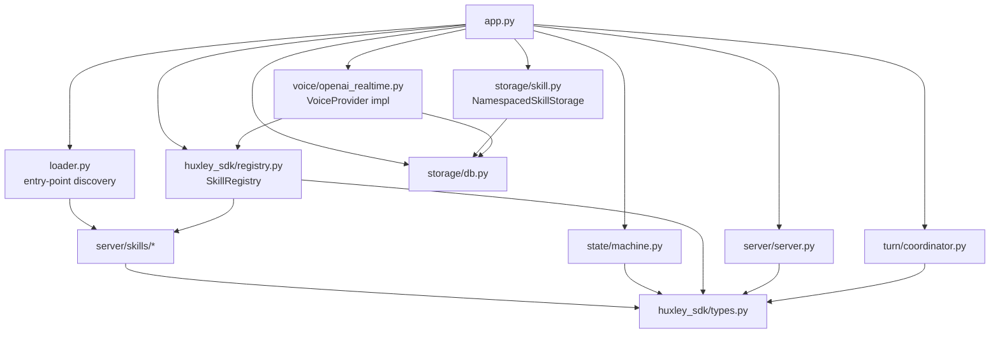

# Architecture

This is the architecture of **Huxley the framework** — the parts that are persona-agnostic and skill-agnostic. Persona spec lives in [`server/personas/`](./personas/), skill spec in [`skills/`](./skills/). Diagrams use the Abuelo persona as the worked example because it's the canonical one, but the architecture is identical for any persona.

> **Layout**: the Python source lives under `server/`. Runtime is `server/runtime/` (the `huxley` package), SDK is `server/sdk/` (the `huxley_sdk` package), each first-party skill is its own workspace member under `server/skills/<name>/`. Personas live alongside under `server/personas/<name>/`. Clients (PWA, firmware) are at `clients/<name>/`; the marketing site is at `site/`.

## System overview



## Core invariants

### Audio path: client owns I/O, framework owns the brain

Huxley never touches audio hardware. Every client — browser for dev, ESP32 for production — captures the mic, drives the speaker, and streams PCM16 at 24 kHz over WebSocket. Huxley relays audio to the voice provider, dispatches tool calls, runs skills, manages state. This is why the same framework code works for any client without re-architecture.

See [decision 2026-04-12 — Python server does not own audio hardware](./decisions.md#2026-04-12--python-server-does-not-own-audio-hardware).

### One audio pipe out

There is **one** audio channel out to the client (`server.send_audio`). Both LLM model audio AND tool-produced audio (audiobook playback, future media) flow through it, in the exact same PCM16 24 kHz mono format. The client has one playback code path and cannot tell the two sources apart. The TurnCoordinator sequences them so model speech always comes before tool audio in the same turn.

See [decision 2026-04-13 — Audiobook audio streams through the WebSocket](./decisions.md#2026-04-13--audiobook-audio-streams-through-the-websocket-not-local-playback) and [`turns.md`](./turns.md).

### Persona is config, not code

The framework loads a `persona.yaml` at startup and uses it to build the system prompt, register the listed skills, and configure the voice provider. Swap the persona file → swap the agent. Code does not know "this is for a blind elderly user" — that knowledge lives entirely in the persona file and the constraint definitions it references.

## Runtime topology

> Added in T1.13. Background: [decision: hot persona swap via reconnect](./decisions.md#2026-05-01--hot-persona-swap-via-reconnect-not-in-band-t113).

A Huxley process runs ONE `Runtime` (process singleton). The Runtime owns the `AudioServer` (lifelong WebSocket listener) and a swappable `current_app` of type `Application`. When a client reconnects with a different `?persona=<name>` query, the Runtime constructs a new `Application` for that persona, atomically replaces `current_app`, and tears down the old Application in the background.

```
Runtime (process singleton)
├── AudioServer           ← single TCP listener, lifelong
├── current_app: Application | None
│   ├── Storage (per-persona DB)
│   ├── SkillRegistry
│   ├── VoiceProvider (OpenAI Realtime)
│   ├── TurnCoordinator, FocusManager, ...
│   └── ... (everything that's persona-bound)
└── _teardown_task        ← background shutdown of previous app
```

**Responsibility split**:

- **`Runtime`** — process-wide concerns. Owns the AudioServer, resolves the default persona at boot per the locked rule (env > single-persona autodiscovery > alphabetic-first-with-loud-log), implements the swap algorithm, signal handlers, the audio-server task, the shutdown event.
- **`Application`** — per-persona stack. Reconstructed on each persona swap. Receives a reference to the lifelong `AudioServer` (its `send_*` methods reach the active client) but does NOT install callbacks on it. `Application.start(auto_connect=True)` brings up storage, skills, state machine; `Application.shutdown()` is the inverse.

**Swap dispatch** — AudioServer's callbacks are bound to runtime-level `_shim_*` methods that forward to `current_app.on_*`. The dispatch target rebinds atomically when `current_app` changes — no need to tell AudioServer "your callbacks moved." The 9 dispatch methods (`on_wake_word`, `on_ptt_start`, `on_ptt_stop`, `on_audio_frame`, `on_reset`, `on_language_select`, `on_list_sessions`, `on_get_session`, `on_delete_session`) constitute Application's public WS-event surface.

**Swap algorithm**:

1. **Same persona** → no-op (early return).
2. **Different persona** → acquire `_swap_lock` (serializes concurrent swap requests so the loser doesn't get reference-overwritten), then:
3. Await any in-flight `_teardown_task` (capped at `_TEARDOWN_TIMEOUT_S = 10s` via `asyncio.wait_for(asyncio.shield(...))`) so we don't open the same SQLite DB the previous teardown is still writing to.
4. **Pre-validate**: `Application(persona, language=requested_language) + start(auto_connect=True)`. The runtime threads the connection's `?lang=` into the new Application so its OpenAI session opens in the right language from the start — avoids a "default-then-disconnect-and-reconnect" cascade that leaks IDLE state to the new client. If start raises, OLD app is untouched and the exception propagates.
5. **Atomic ref swap**: `self.current_app = new_app`. Single Python assignment.
6. **Background teardown**: `asyncio.create_task(self._teardown_app(old_app))`. The user is unblocked immediately; the old app's provider summary write, skill teardowns, storage close happen out of band.

Eager-connect on swap (`auto_connect=True`) is correct: idle Realtime sessions cost $0, and the state machine has no IDLE→CONNECTING transition on PTT — so a "lazy" swap would leave the new persona unreachable until the user reset the connection.

**Shared AudioServer + dying-app gating**: AudioServer is process-singleton, shared between `current_app` and any previous Application still running its background teardown. An Application's `_on_state_transition` handler relays state changes through `self.server.send_state(...)` — which routes to whatever WS the AudioServer currently has, i.e. the NEW persona's connection. Without gating, the OLD app's teardown-time CONVERSING→IDLE transition would leak `state: IDLE` to the new client, firing the PWA's unexpected-session-drop error tone and zeroing the appState the PTT handler dispatches on. Application's outbound paths (`_on_state_transition`, etc.) gate on `_shutting_down` to suppress this leak. The dying app can't speak to the wire; the runtime already swapped current_app to the new persona.

**One process = one human**, by convention. Two humans on one machine = two Huxley processes, each in its own working directory with its own `personas/`, `.env`, port, and DBs. There is no profile abstraction; multi-instance follows standard Unix-daemon shape. See [decision: multi-instance via cwds](./decisions.md#2026-05-01--multi-instance-deployment-via-cwds-no-profile-abstraction-t113). Canonical layout for a household:

```
~/huxley-grandpa/
├── .env                  # grandpa's HUXLEY_OPENAI_API_KEY, TELEGRAM creds
└── personas/
    ├── abuelos/persona.yaml
    └── librarian/persona.yaml

~/huxley-kid/
├── .env                  # kid's separate creds
└── personas/
    └── buddy/persona.yaml

# Run each instance from its own cwd:
(cd ~/huxley-grandpa && HUXLEY_SERVER_PORT=8765 uv run huxley) &
(cd ~/huxley-kid     && HUXLEY_SERVER_PORT=8766 uv run huxley) &
```

Production uses one launchd plist per instance with different `WorkingDirectory`. Privacy is filesystem-enforced; the two processes share nothing.

### Per-skill secrets and schema versions (T1.14)

Each `SkillContext` carries two storage handles routed at the persona's data dir:

- `ctx.storage` — namespaced KV adapter (`NamespacedSkillStorage`) over the persona's SQLite DB; keys prefixed with `<skill_name>:`. See `server/runtime/src/huxley/storage/skill.py`.
- `ctx.secrets` — file-backed per-skill secrets store (`JsonFileSecrets`) at `<persona.data_dir>/secrets/<skill_name>/values.json`, perms `0700/0600`, atomic writes via tmp + replace, asyncio.Lock around RMW. See `server/runtime/src/huxley/storage/secrets.py`.

Both are constructed inline in `Application._build_skill_context` (one `JsonFileSecrets` per skill, pointed at its own dir). Privacy between personas is filesystem-enforced via the data dir; privacy between skills sharing a persona is `persona.yaml`'s `skills:` enable list (a skill not listed never imports its setup code, regardless of what's installed in the workspace venv).

Per-skill `data_schema_version` is persisted in the persona's existing `schema_meta` table under `skill_version:<name>`. `Application.start` runs `_check_skill_schema_versions` (read-only, logs `skill.schema.upgrade_needed` / `downgrade_detected` warnings on mismatch) BEFORE `setup_all`, then runs `_persist_skill_schema_versions` AFTER `setup_all` succeeds. The split means a torn skill setup leaves stored at the OLD version so the next boot re-warns the same way.

## State machine

The session-level state machine has 3 states:



- **IDLE** — no voice provider session. Resting state.
- **CONNECTING** — opening the session, sending `session.update` with tool schemas.
- **CONVERSING** — session open, PTT works, tool calls dispatch, audiobook playback may be happening — media is orthogonal to session state.

Media playback is **not** a session state. It's tracked by the coordinator's current `ContentStreamObserver`, which outlives turns: a book started in turn N keeps playing until turn N+M interrupts it. The voice provider session stays open during book playback (idle sessions cost zero tokens), and pressing PTT mid-book goes through the turn coordinator's interrupt method rather than a state transition.

See [`turns.md`](./turns.md) and [decision 2026-04-13 — Turn-based coordinator for voice tool calls](./decisions.md#2026-04-13--turn-based-coordinator-for-voice-tool-calls).

## Sequence — a PTT turn in CONVERSING



## Sequence — a tool call that starts an audiobook



**Key insights**:

1. **A skill never touches the coordinator, state machine, or the voice provider directly.** It returns a `ToolResult` with an optional `side_effect` (today: `AudioStream(factory=...)`; future kinds reuse the same shape). The framework executes side effects at the right moment.
2. **Speech before factories, always.** The coordinator forwards the model's audio deltas first, then invokes pending factories on `response.done`. Tool audio never jumps in without an ack — structurally impossible, not "fixed with a flag."
3. **Same audio pipe for everything.** Model speech and tool audio both travel through `server.send_audio`. The client doesn't branch on source.
4. **Atomic interrupts.** A new `ptt_start` during a live turn runs `coordinator.interrupt()`: drop flag → clear pending factories → audio_clear → cancel media task → cancel LLM response → mark turn interrupted. The running media task's `finally` block persists any terminal state (e.g. audiobook position), so seek/forward/interrupt are all transaction-safe without eager storage writes.

## Turn coordinator internals

The `TurnCoordinator` orchestrates a single user-assistant exchange. State
lives in five collaborators — each one owns a single axis of responsibility
so the I/O-plane primitives (T1.4) slot into existing seams instead of
reshaping the coordinator:

- **`TurnFactory`** creates every `Turn` instance, tagged with `TurnSource`
  (`USER`, `COMPLETION`, `INJECTED`). `INJECTED` is reserved for the
  `inject_turn` primitive.
- **`MicRouter`** is the sole destination for mic PCM. The voice provider
  is today's only handler; `InputClaim` will install short-lived claims
  through the same `claim()/release()` API.
- **`SpeakingState`** tracks who currently owns the speaker — one of
  `user | factory | completion | injected | claim | None`. The named-owner
  shape replaces the boolean flag that used to be flipped at six call
  sites; `release(expected)` is a safe no-op when something else has taken
  over.
- **`ContentStreamObserver`** wraps the single running audio-stream
  `asyncio.Task` and applies a linear PCM gain envelope on focus
  transitions. Implements the focus-management `ChannelObserver`
  protocol. Lives as the `observer` field of a CONTENT-channel
  `Activity`; `FocusManager` delivers `FOREGROUND/PRIMARY` on acquire
  (spawns the pump, ramps gain up to 1.0 if it was ducked),
  `NONE/MUST_STOP` on release (cancels the pump),
  `BACKGROUND/MAY_DUCK` when a MIXABLE Activity is preempted (ramps
  gain down to 0.3 over 100ms; **pump keeps running**), and
  `BACKGROUND/MUST_PAUSE` when a NONMIXABLE Activity is preempted
  (cancels the pump immediately — overlaying two voices is worse
  than a pause). All current Abuelo content is NONMIXABLE (spoken
  word), so the MAY_DUCK code path is scaffolding for future MIXABLE
  streams (background music, ambient).
- **`FocusManager`** (app-owned, constructed by `Application`,
  injected into `TurnCoordinator`) is the serialized arbitrator over
  the speaker. Manages Activity stacks per channel (`DIALOG`, `COMMS`,
  `ALERT`, `CONTENT`), delivers `(FocusState, MixingBehavior)`
  transitions to observers, and enforces single-task mutation via the
  actor pattern. Exposes `wait_drained()` so the coordinator can
  synchronize interrupt barriers against the actor's event processing.

See `docs/io-plane.md` for the primitives these collaborators will support
and `docs/turns.md` for the turn state machine they orchestrate.

### Authority contract — `SpeakingState` vs `FocusManager`

Two overlapping-but-distinct concerns live side by side. To prevent drift, the split is explicit:

**`SpeakingState` is authoritative for "should the client show a speaking indicator right now."** It tracks actual audio flow out the WebSocket. Its `notify(bool)` callback fires the `model_speaking` wire event that drives the client's UI and silence-timer gating. Writes happen on concrete audio-bearing events:

- `acquire(owner)` when the first audio chunk of a turn actually lands (first `on_audio_delta`, or first chunk of a content-stream pump)
- `force_release()` on `on_audio_done`, `interrupt()`, `on_session_disconnected`
- `transfer(from, to)` when a stream hands ownership to a synthetic follow-up turn (e.g. FACTORY → COMPLETION at `_maybe_fire_completion_prompt`) — no notify fires; the client is still seeing `model_speaking=true`, only the internal owner label changes

**`FocusManager` is authoritative for "who has claimed the speaker resource."** A channel `Activity` being FOREGROUND means "this activity holds the right to speak," which is a _logical_ claim — it can precede actual audio by hundreds of milliseconds (first-token latency on the LLM, subprocess spawn on a content stream). Writes happen on claim lifecycle events:

- `acquire(activity)` when a skill or the coordinator registers an intent to speak
- `release(channel, interface_name)` on clean end
- `stop_foreground()` / `stop()` on barrier events
- patience expiry, preemption, same-interface replacement — all mailbox-driven

**The invariant** (maintained by the coordinator, not the framework): every transition of `FocusManager`-delivered FocusState for a DIALOG or CONTENT channel corresponds to exactly one matched transition of `SpeakingState` — but _not necessarily at the same instant_. The coordinator owns the bridge:

| FocusManager event                                    | Coordinator response       | SpeakingState write                                        |
| ----------------------------------------------------- | -------------------------- | ---------------------------------------------------------- |
| DIALOG → FOREGROUND (user turn starts)                | wait for first audio delta | on first delta: `acquire(USER)`                            |
| DIALOG → NONE (turn interrupted / ends)               | stop consuming model audio | `force_release()` (idempotent — may already be clear)      |
| CONTENT → FOREGROUND (stream starts)                  | spawn pump                 | on first chunk: `acquire(FACTORY)`                         |
| CONTENT → BACKGROUND/MAY_DUCK                         | ramp gain (no pause)       | no change; factory still speaking                          |
| CONTENT → BACKGROUND/MUST_PAUSE                       | cancel pump                | `release(FACTORY)` if owned                                |
| CONTENT → NONE                                        | cancel pump, clean up      | `release(FACTORY)` if owned                                |
| DIALOG preempts CONTENT (completion follow-up prompt) | synthesize COMPLETION turn | `transfer(FACTORY → COMPLETION)` — no notify, same speaker |

**Consequences for callers:**

- Skills never touch `SpeakingState`. It's a framework-internal artifact of the audio pipeline.
- Skills describe their intent via `SideEffect` types (`AudioStream`, future `InputClaim`); the framework translates to `FocusManager` events and, as audio actually flows, updates `SpeakingState`.
- Tests can assert on either — `FocusManager` state for "did this claim land," `SpeakingState` for "did the user hear audio" — but never on both as if they're the same thing.

**When they disagree** (a turn holds DIALOG FOREGROUND but no audio has flowed yet, or a stream pumped one chunk then was preempted before `release` fired), `SpeakingState` is what the client sees. `FocusManager` is what the framework knows. Reconciliation happens at the next barrier (`interrupt()`, `on_session_disconnected`, natural response-done).

**A third state holder: `_injected_queue` on the coordinator (Stage 1d).** When `inject_turn` is called while a user or synthetic turn is already in progress, the request is queued here and drains in `_apply_side_effects` when a turn ends without pending content. This is authoritative for "what proactive speech is pending that hasn't been claimed yet" — a distinct question from either "who holds the speaker" (FocusManager) or "is audio flowing" (SpeakingState). Skills never see this queue directly; they call `ctx.inject_turn(prompt, dedup_key=...)` and the framework decides "fire now or queue." The `coord.inject_turn_queued / _dequeued / _deduped / _dropped` log events are the observability surface — a skill debugging "why didn't my reminder fire" should look here first, not at FocusManager stacks. The queue is preserved across `interrupt()` and `on_session_disconnected` so user interruptions don't lose pending reminders.

This contract is load-bearing for T1.4 Stage 1c onward. Any future primitive that speaks (inject_turn, InputClaim with `speaker_source`) must name explicitly which of the three it's writing to, and the framework bridges the rest.

## Dependency flow (no cycles)



Dependencies flow **downward**. `huxley_sdk/types.py` is the universal leaf — everyone imports from it, it imports from nothing. `runtime.py` is the root — nothing imports from it, it wires everything (constructs `AudioServer` once and the active `Application` on demand per persona swap). `app.py` sits below it as the per-persona orchestrator. Skill packages depend only on `huxley_sdk`, never on framework internals; the framework reaches them only through entry-point discovery and the `Skill` protocol. This is the boundary that makes third-party skills possible.

## Where to look in code

| Concern                           | File                                                             |
| --------------------------------- | ---------------------------------------------------------------- |
| Process root / persona swap       | `server/runtime/src/huxley/runtime.py`                           |
| Per-persona orchestrator          | `server/runtime/src/huxley/app.py`                               |
| WebSocket audio server            | `server/runtime/src/huxley/server/server.py`                     |
| State machine + transitions       | `server/runtime/src/huxley/state/machine.py`                     |
| Turn coordinator + factory fire   | `server/runtime/src/huxley/turn/coordinator.py`                  |
| Turn vocabulary (`Turn`, states)  | `server/runtime/src/huxley/turn/state.py`                        |
| `TurnFactory`                     | `server/runtime/src/huxley/turn/factory.py`                      |
| `MicRouter` (mic-frame dispatch)  | `server/runtime/src/huxley/turn/mic_router.py`                   |
| `SpeakingState` (speaker owner)   | `server/runtime/src/huxley/turn/speaking_state.py`               |
| Turn observers (Dialog, Content)  | `server/runtime/src/huxley/turn/observers.py`                    |
| `FocusManager` + actor loop       | `server/runtime/src/huxley/focus/manager.py`                     |
| Focus vocabulary (Channel, State) | `server/runtime/src/huxley/focus/vocabulary.py`                  |
| VoiceProvider protocol            | `server/runtime/src/huxley/voice/provider.py`                    |
| OpenAI Realtime implementation    | `server/runtime/src/huxley/voice/openai_realtime.py`             |
| OpenAI event schemas              | `server/runtime/src/huxley/voice/openai_protocol.py`             |
| StubVoiceProvider (for tests)     | `server/runtime/src/huxley/voice/stub.py`                        |
| Skill protocol + ToolResult       | `server/sdk/src/huxley_sdk/types.py`                             |
| Skill registry + dispatch         | `server/sdk/src/huxley_sdk/registry.py`                          |
| SkillContext + SkillStorage       | `server/sdk/src/huxley_sdk/types.py`                             |
| FakeSkill (test helper)           | `server/sdk/src/huxley_sdk/testing.py`                           |
| Skill loader (entry points)       | `server/runtime/src/huxley/loader.py`                            |
| Audiobooks skill                  | `server/skills/audiobooks/src/huxley_skill_audiobooks/skill.py`  |
| Audiobook ffmpeg stream generator | `server/skills/audiobooks/src/huxley_skill_audiobooks/player.py` |
| System skill                      | `server/skills/system/src/huxley_skill_system/skill.py`          |
| SQLite wrapper                    | `server/runtime/src/huxley/storage/db.py`                        |
| Per-skill namespaced KV adapter   | `server/runtime/src/huxley/storage/skill.py`                     |
| Per-skill secrets (T1.14)         | `server/runtime/src/huxley/storage/secrets.py`                   |
| Config (env-driven settings)      | `server/runtime/src/huxley/config.py`                            |

After stage 4 lands, persona-driven configuration takes over:

```
server/personas/abuelos/persona.yaml   # the Abuelo persona spec
server/personas/abuelos/data/          # audiobooks library + sqlite db
```
