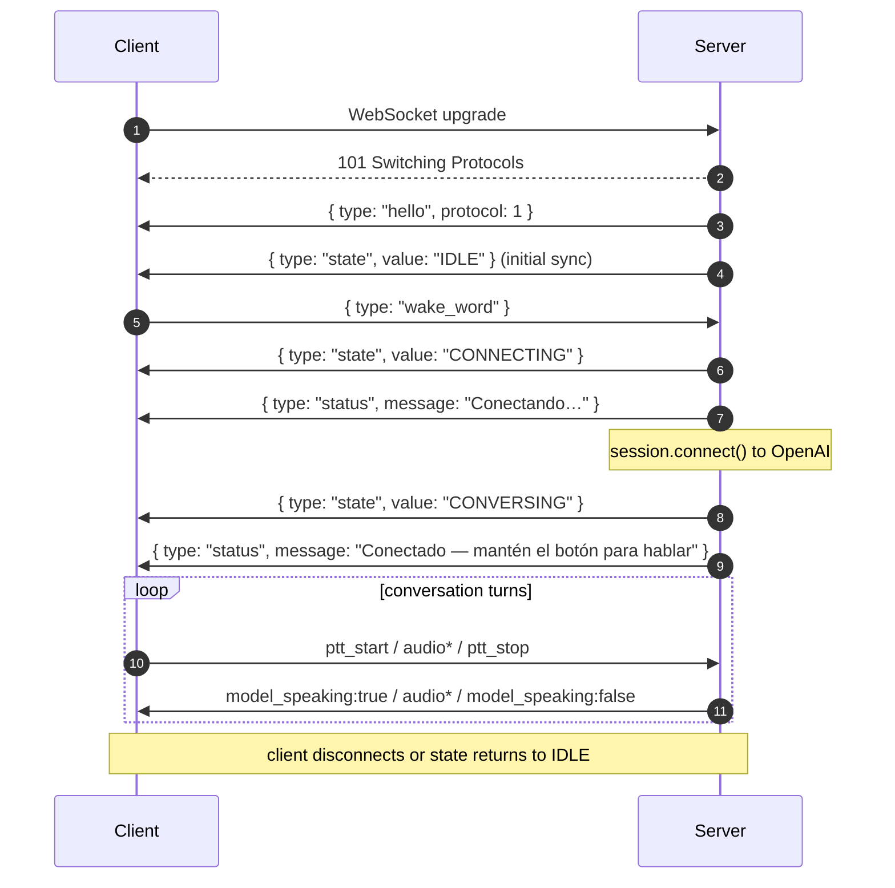

# WebSocket Protocol

The contract between every audio client (browser today, ESP32 later) and the Huxley framework. This is the product boundary: skills, state, persona, and the voice provider live framework-side; microphone and speaker live client-side.

Any client that implements this protocol is a valid Huxley client. The framework runs the same regardless of who's connected.

## Transport

- **Type**: WebSocket (`ws://`)
- **Default URL**: `ws://localhost:8765`
- **Audio format**: PCM16, 24 kHz, mono, little-endian
- **Encoding**: audio bytes are base64-encoded inside JSON message payloads
- **Concurrency**: one active client at a time. A second connection **evicts the older client** by closing it with code `1001 — Replaced by new client`, then accepts the new one. Rationale in [decision: one client at a time](./decisions.md#2026-04-12--one-websocket-client-at-a-time) — a fresh connect is almost always a browser reload or a re-flashed device, and should win over a stale socket.

## Message format

Every message is a JSON object with a `type` field. Binary frames are not used (simpler, debuggable in devtools).

## Client → server

| `type`         | Payload                            | Description                                                                                                                                                                                                                                                                                                                                                                                                                                                                                                                                                                                                                                          |
| -------------- | ---------------------------------- | ---------------------------------------------------------------------------------------------------------------------------------------------------------------------------------------------------------------------------------------------------------------------------------------------------------------------------------------------------------------------------------------------------------------------------------------------------------------------------------------------------------------------------------------------------------------------------------------------------------------------------------------------------- |
| `audio`        | `{ data: string }` (base64 PCM16)  | Mic frame. Server forwards to OpenAI only when `ptt_active` is true AND the session is connected AND the model isn't speaking.                                                                                                                                                                                                                                                                                                                                                                                                                                                                                                                       |
| `ptt_start`    | —                                  | User pressed the push-to-talk button. Client should start streaming `audio` messages.                                                                                                                                                                                                                                                                                                                                                                                                                                                                                                                                                                |
| `ptt_stop`     | —                                  | User released PTT. Server commits the audio buffer and asks OpenAI to respond.                                                                                                                                                                                                                                                                                                                                                                                                                                                                                                                                                                       |
| `wake_word`    | —                                  | User wants to start a session. Transitions `IDLE → CONNECTING`. Despite the legacy name, this is **not** a wake word in the traditional sense — it's a "start session" button. May rename to `start_session` in v1.                                                                                                                                                                                                                                                                                                                                                                                                                                  |
| `client_event` | `{ event: string, data?: object }` | **Generic event channel** — dual-purpose observability + skill dispatch. Server always logs as `client.<event>`. If `event` matches a key any skill subscribed via `ctx.subscribe_client_event`, dispatches to those handlers too. **Namespacing**: `huxley.*` reserved for framework-emitted observability events (thinking-tone, silence-timer, ptt UI state — safe to add freely, no skill should subscribe to these). Skill-owned keys use `<skill-name>.*` (e.g. `calls.panic_button`, `messaging.read_receipt`); skills declare their event set in their docs. No framework-side validation of event names — convention is enforced by review. |
| `reset`        | —                                  | **Dev tool.** Drops the current OpenAI session, clears the stored conversation summary, and reconnects fresh. Useful when you want a blank-slate session without restarting the server. No-op if called from a non-dev client (treated as a recoverable unknown type).                                                                                                                                                                                                                                                                                                                                                                               |

## Server → client

| `type`           | Payload                                                                                                                                              | Description                                                                                                                                                                                                                                                                                                                                          |
| ---------------- | ---------------------------------------------------------------------------------------------------------------------------------------------------- | ---------------------------------------------------------------------------------------------------------------------------------------------------------------------------------------------------------------------------------------------------------------------------------------------------------------------------------------------------- |
| `hello`          | `{ protocol: number }`                                                                                                                               | **First message on every connection.** Client checks `protocol` against its own `EXPECTED_PROTOCOL` constant and closes with code `1002` if they differ. Current version: `2`.                                                                                                                                                                       |
| `audio`          | `{ data: string }` (base64 PCM16)                                                                                                                    | Audio chunk for the client to play. Carries OpenAI model audio AND skill-injected audio (audiobook PCM, earcons, completion silence) through the same channel — the client doesn't distinguish source. See [`sounds.md`](./sounds.md) for how skills inject.                                                                                         |
| `state`          | `{ value: "IDLE" \| "CONNECTING" \| "CONVERSING" }`                                                                                                  | Server-side state machine's current state. Sent on every transition and once on client connect for initial sync. Media playback is NOT a session state — see [`turns.md`](./turns.md#7-session-vs-turn-lifetime--playing-state-removed).                                                                                                             |
| `status`         | `{ message: string }`                                                                                                                                | Human-readable status (`"Escuchando…"`, `"Respondiendo…"`). The browser dev UI displays it; a hardware client should **speak** it so blind users know the system is alive. **Dead air is a bug.**                                                                                                                                                    |
| `transcript`     | `{ role: "user" \| "assistant", text: string }`                                                                                                      | Incremental transcript of the conversation. Dev UI only; not used by the ESP32 client.                                                                                                                                                                                                                                                               |
| `model_speaking` | `{ value: boolean }`                                                                                                                                 | `true` when the model starts streaming audio, `false` when done. Client uses this to gate the PTT UI (disable while speaking, or offer it as an interrupt).                                                                                                                                                                                          |
| `set_volume`     | `{ level: number }` (0–100)                                                                                                                          | Adjust the client's output volume. The **client** owns its speaker — the server never touches audio hardware. Level is already clamped to `[0, 100]` before sending.                                                                                                                                                                                 |
| `input_mode`     | `{ mode: "assistant_ptt" \| "skill_continuous", reason: "idle" \| "claim_started" \| "claim_ended" \| "claim_preempted", claim_id: string \| null }` | **Server-authoritative mic-streaming policy.** See [Mic mode](#mic-mode--assistant-address-vs-skill-owned-audio) below. Sent on every transition and once on connect (initial sync). Client is the renderer, not the state owner.                                                                                                                    |
| `claim_started`  | `{ claim_id: string, skill: string, title: string \| null }`                                                                                         | Observability + UI — a skill took ownership of the mic via `InputClaim`. `title` is the skill-supplied human-readable label (e.g., the contact name on a call); UI-capable clients show it as the status while the claim is active. `null` when the skill didn't set `InputClaim.title`. Behavioral signal is the `input_mode` that fires alongside. |
| `claim_ended`    | `{ claim_id: string, end_reason: "natural" \| "user_ptt" \| "preempted" \| "error" }`                                                                | Claim has terminated. Behavioral signal is `input_mode=assistant_ptt` fired immediately after.                                                                                                                                                                                                                                                       |
| `stream_started` | `{ stream_id: string, label: string \| null }`                                                                                                       | A long-form `AudioStream` side effect has begun (audiobook, radio). `label` is the human-readable content name (e.g. `"Don Quixote"`, `"Radio Clásica"`). Client uses this to enter the `"playing"` orb state and show the label in the status line.                                                                                                 |
| `stream_ended`   | `{ stream_id: string, end_reason: "natural" \| "interrupted" }`                                                                                      | The stream has finished. `"natural"` = played to completion; `"interrupted"` = stopped by user PTT, a new tool call, or session reset. Client returns to `"idle"` orb state.                                                                                                                                                                         |
| `dev_event`      | `{ kind: string, payload: object }`                                                                                                                  | Dev-UI observability channel. Additive — production clients ignore unknown types. See [Dev observability channel](#dev-observability-channel).                                                                                                                                                                                                       |

## Connection lifecycle

## Server-side PTT gating rules

The server enforces these regardless of what the client sends:

1. Audio frames are **only** forwarded to OpenAI when **all** of these are true:
   - `_ptt_active == true`
   - `session.is_connected == true`
   - `session.is_model_speaking == false` (prevents echo feedback)
2. A PTT release with fewer than 25 captured frames (~133 ms of audio) is treated as an accidental tap: no commit, no response, just a status _"Muy corto — mantén el botón mientras hablas."_ The threshold is set above the tap-noise floor while still allowing a quick _"Sí"_.
3. Pressing PTT while the model is speaking **cancels** the current response and starts listening (interrupt behavior).
4. Pressing PTT while an `InputClaim` is active (mic-mode = `skill_continuous`) **ends the claim** with `USER_PTT` and starts a fresh listening turn. The accidental-tap 25-frame filter in rule 2 does **not** apply during `skill_continuous` — any press, even a brief one, is a hang-up intent. (A 300 ms server-side debounce after a claim latches drops the same-tap bounce that could otherwise end the call the instant it connects.)

## Mic mode — assistant-address vs. skill-owned audio

Two concepts the protocol keeps separate:

- **Addressing the assistant** — the user's gesture that says "I want the assistant to hear me now." Today that's PTT (press-and-hold); tomorrow it may be a wake word or a VAD trigger. Client-side concept; server doesn't care which specific trigger is in use.
- **Who owns the mic right now** — by default, the assistant (gated by the first concept). When a skill has an active `InputClaim` (e.g. a Telegram voice call, a voice memo recording), the skill owns the mic continuously, **independent** of whether the user is actively pressing PTT. The skill receives raw PCM via its `on_mic_frame` callback; the LLM is suspended for the duration.

The server is the source of truth and projects both concepts into a single `input_mode` enum sent to the client:

| `mode`             | Meaning                                                                                                                                                                                                                                                                                     |
| ------------------ | ------------------------------------------------------------------------------------------------------------------------------------------------------------------------------------------------------------------------------------------------------------------------------------------- |
| `assistant_ptt`    | Default. Client streams `audio` frames **only** while the user's assistant-address trigger is active (today: PTT held). Frames reach the LLM (subject to the gating rules above).                                                                                                           |
| `skill_continuous` | A skill owns the mic. Client streams `audio` frames **continuously** until the mode flips back. Frames reach the skill's `on_mic_frame` handler; the LLM is suspended. A PTT press during this mode is the user saying "I want the assistant back" — server ends the claim with `USER_PTT`. |

Lifecycle:

1. On connect, the server sends `input_mode` with the current mode once as part of the initial sync burst (alongside `state`). A reconnecting client can land mid-call and will be told.
2. When an `InputClaim` latches, the server emits `claim_started` (observability) followed by `input_mode=skill_continuous` (behavior).
3. When the claim ends for any `ClaimEndReason`, the server emits `claim_ended` (with the reason) followed by `input_mode=assistant_ptt`.

**Why this shape (vs. a "single mic hot" boolean)**: the client needs both _whether_ to open the mic AND _where_ the bytes semantically go; collapsing into one enum the client can render directly avoids the "re-implement the state machine on every client" bug class. The server staying authoritative means a reconnect mid-call recovers correctly.

**Forward-compat**: when we add wake-word or VAD, the `assistant_ptt` value extends to `assistant_gated { trigger: "ptt" | "wakeword" | "vad" }` — additive, non-breaking. The _concepts_ are still orthogonal; the _wire representation_ is a projection of both into the values the client behaves on.

## Error behavior

| Failure                       | Client observes                                                                                         |
| ----------------------------- | ------------------------------------------------------------------------------------------------------- |
| Protocol version mismatch     | Client closes with code `1002`, reason `"Protocol version mismatch"`, shows status banner               |
| Second client connects        | **Existing client** closed with code `1001`, reason `"Replaced by new client"`. New client is accepted. |
| OpenAI connection fails       | `state: CONNECTING` → `state: IDLE` + `status: "Error al conectar — intenta de nuevo"`                  |
| OpenAI disconnect mid-session | `state: CONVERSING` → `state: IDLE` silently; next `ptt_start` outside CONVERSING returns a status      |
| Malformed client message      | Silently ignored (no error response)                                                                    |

## Dev observability channel

A single generic message type (`dev_event`) carries everything the dev UI might want to visualize without bloating the production protocol. Production clients (ESP32) ignore unknown message types, so this costs zero bandwidth and zero code in production.

**Shape**: `{ type: "dev_event", kind: string, payload: object }` — `kind` discriminates what the payload means; the dev UI dispatches on it to render different row types.

**Ordering**: for a turn that involves a tool call, the dev UI observes:

1. `ptt_stop` (client → server)
2. Server commits buffer + asks OpenAI to respond
3. `dev_event` with `kind: tool_call` (server → client) — after the skill has dispatched and the function output has been sent back to OpenAI
4. Audio deltas for the model's follow-up response
5. `model_speaking: false`

### Known kinds

| `kind`      | Payload fields                   | Emitted when                                                       |
| ----------- | -------------------------------- | ------------------------------------------------------------------ |
| `tool_call` | `{ name, args, output, action }` | After a skill dispatches a function call, with the result inlined. |

### Adding a new kind

1. Emit from wherever the signal originates, via an `on_dev_event` callback passed through `SessionManager` (or directly from `Application`).
2. Wire it to `AudioServer.send_dev_event(kind, payload)`.
3. Add the `kind` to the table above with its payload shape.
4. Add a `case` to the dev UI's switch in `web/src/routes/+page.svelte`.

No new message types. No new plumbing. Observability scales without touching the production contract.

## Future

- **Binary frames** for audio — would reduce JSON+base64 overhead. Requires ESP32-side cbor/msgpack. Not worth it for the browser.
- **Rename `wake_word` → `start_session`** — current name is a legacy from when the server owned a real wake-word detector.
- **Status-as-audio channel** — a parallel `status_audio` message with a short TTS clip for spoken status, so the ESP32 client doesn't need its own TTS.

## Source of truth

The Python implementation in [`packages/core/src/huxley/server/server.py`](../packages/core/src/huxley/server/server.py) is the canonical implementation. This doc must match. If they diverge, fix whichever is wrong in the same commit.
