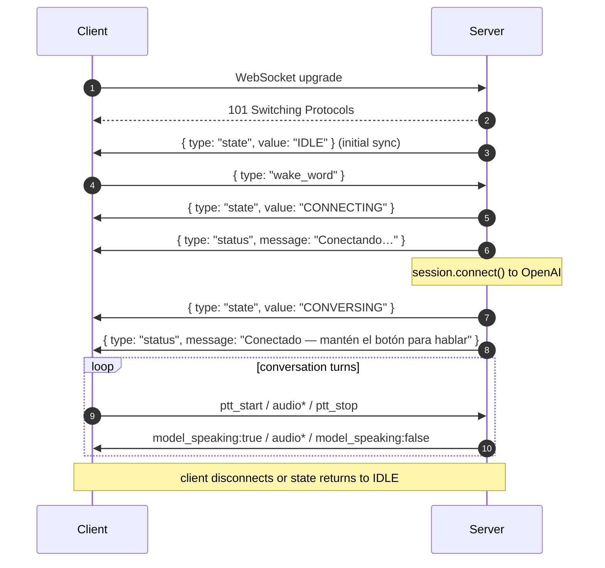

# WebSocket Protocol

The contract between every audio client (browser today, ESP32 later) and the Huxley framework. This is the product boundary: skills, state, persona, and the voice provider live framework-side; microphone and speaker live client-side.

Any client that implements this protocol is a valid Huxley client. The framework runs the same regardless of who's connected.

## Transport

- **Type**: WebSocket (`ws://`)
- **Default URL**: `ws://localhost:8765`
- **Audio format**: PCM16, 24 kHz, mono, little-endian
- **Encoding**: audio bytes are base64-encoded inside JSON message payloads
- **Concurrency**: one active client at a time. A second connection is rejected with close code `1008 — Server busy`. See [decision: one client at a time](./decisions.md#2026-04-12--one-websocket-client-at-a-time).

## Message format

Every message is a JSON object with a `type` field. Binary frames are not used (simpler, debuggable in devtools).

## Client → server

| `type`      | Payload                           | Description                                                                                                                                                                                                         |
| ----------- | --------------------------------- | ------------------------------------------------------------------------------------------------------------------------------------------------------------------------------------------------------------------- |
| `audio`     | `{ data: string }` (base64 PCM16) | Mic frame. Server forwards to OpenAI only when `ptt_active` is true AND the session is connected AND the model isn't speaking.                                                                                      |
| `ptt_start` | —                                 | User pressed the push-to-talk button. Client should start streaming `audio` messages.                                                                                                                               |
| `ptt_stop`  | —                                 | User released PTT. Server commits the audio buffer and asks OpenAI to respond.                                                                                                                                      |
| `wake_word` | —                                 | User wants to start a session. Transitions `IDLE → CONNECTING`. Despite the legacy name, this is **not** a wake word in the traditional sense — it's a "start session" button. May rename to `start_session` in v1. |

## Server → client

| `type`           | Payload                                             | Description                                                                                                                                                                                                                              |
| ---------------- | --------------------------------------------------- | ---------------------------------------------------------------------------------------------------------------------------------------------------------------------------------------------------------------------------------------- |
| `audio`          | `{ data: string }` (base64 PCM16)                   | Audio chunk from the OpenAI model. Client plays it.                                                                                                                                                                                      |
| `state`          | `{ value: "IDLE" \| "CONNECTING" \| "CONVERSING" }` | Server-side state machine's current state. Sent on every transition and once on client connect for initial sync. Media playback is NOT a session state — see [`turns.md`](./turns.md#7-session-vs-turn-lifetime--playing-state-removed). |
| `status`         | `{ message: string }`                               | Human-readable status (`"Escuchando…"`, `"Respondiendo…"`). The browser dev UI displays it; the production ESP32 client should **speak** it so grandpa knows the system is alive. **Dead air is a bug.**                                 |
| `transcript`     | `{ role: "user" \| "assistant", text: string }`     | Incremental transcript of the conversation. Dev UI only; not used by the ESP32 client.                                                                                                                                                   |
| `model_speaking` | `{ value: boolean }`                                | `true` when the model starts streaming audio, `false` when done. Client uses this to gate the PTT UI (disable while speaking, or offer it as an interrupt).                                                                              |
| `dev_event`      | `{ kind: string, payload: object }`                 | Dev-UI observability channel. Additive — production clients ignore unknown types. See [Dev observability channel](#dev-observability-channel).                                                                                           |

## Connection lifecycle

## Server-side PTT gating rules

The server enforces these regardless of what the client sends:

1. Audio frames are **only** forwarded to OpenAI when **all** of these are true:
   - `_ptt_active == true`
   - `session.is_connected == true`
   - `session.is_model_speaking == false` (prevents echo feedback)
2. A PTT release with fewer than 3 captured frames is treated as an accidental tap: no commit, no response, just a status _"Muy corto — mantén el botón mientras hablas."_
3. Pressing PTT while the model is speaking **cancels** the current response and starts listening (interrupt behavior).

## Error behavior

| Failure                       | Client observes                                                                                    |
| ----------------------------- | -------------------------------------------------------------------------------------------------- |
| Server busy (second client)   | Close code `1008`, reason `"Server busy — one client at a time"`                                   |
| OpenAI connection fails       | `state: CONNECTING` → `state: IDLE` + `status: "Error al conectar — intenta de nuevo"`             |
| OpenAI disconnect mid-session | `state: CONVERSING` → `state: IDLE` silently; next `ptt_start` outside CONVERSING returns a status |
| Malformed client message      | Silently ignored (no error response)                                                               |

## Dev observability channel

A single generic message type (`dev_event`) carries everything the dev UI might want to visualize without bloating the production protocol. Production clients (ESP32) ignore unknown message types, so this costs zero bandwidth and zero code in production.

**Shape**: `{ type: "dev_event", kind: string, payload: object }` — `kind` discriminates what the payload means; the dev UI dispatches on it to render different row types.

**Ordering**: for a turn that involves a tool call, the dev UI observes:

1. `ptt_stop` (client → server)
2. Server commits buffer + asks OpenAI to respond
3. `dev_event` with `kind: tool_call` (server → client) — after the skill has dispatched and the function output has been sent back to OpenAI
4. Audio deltas for the model's follow-up response
5. `model_speaking: false`

### Known kinds

| `kind`      | Payload fields                   | Emitted when                                                       |
| ----------- | -------------------------------- | ------------------------------------------------------------------ |
| `tool_call` | `{ name, args, output, action }` | After a skill dispatches a function call, with the result inlined. |

### Adding a new kind

1. Emit from wherever the signal originates, via an `on_dev_event` callback passed through `SessionManager` (or directly from `Application`).
2. Wire it to `AudioServer.send_dev_event(kind, payload)`.
3. Add the `kind` to the table above with its payload shape.
4. Add a `case` to the dev UI's switch in `web/src/routes/+page.svelte`.

No new message types. No new plumbing. Observability scales without touching the production contract.

## Future

- **Binary frames** for audio — would reduce JSON+base64 overhead. Requires ESP32-side cbor/msgpack. Not worth it for the browser.
- **Protocol versioning** — add a `protocol_version` field to the first client message. Worth adding when we have a second client type (ESP32).
- **Rename `wake_word` → `start_session`** — current name is a legacy from when the server owned a real wake-word detector.
- **Status-as-audio channel** — a parallel `status_audio` message with a short TTS clip for spoken status, so the ESP32 client doesn't need its own TTS.

## Source of truth

The Python implementation in [`packages/core/src/huxley/server/server.py`](../packages/core/src/huxley/server/server.py) is the canonical implementation. This doc must match. If they diverge, fix whichever is wrong in the same commit.
