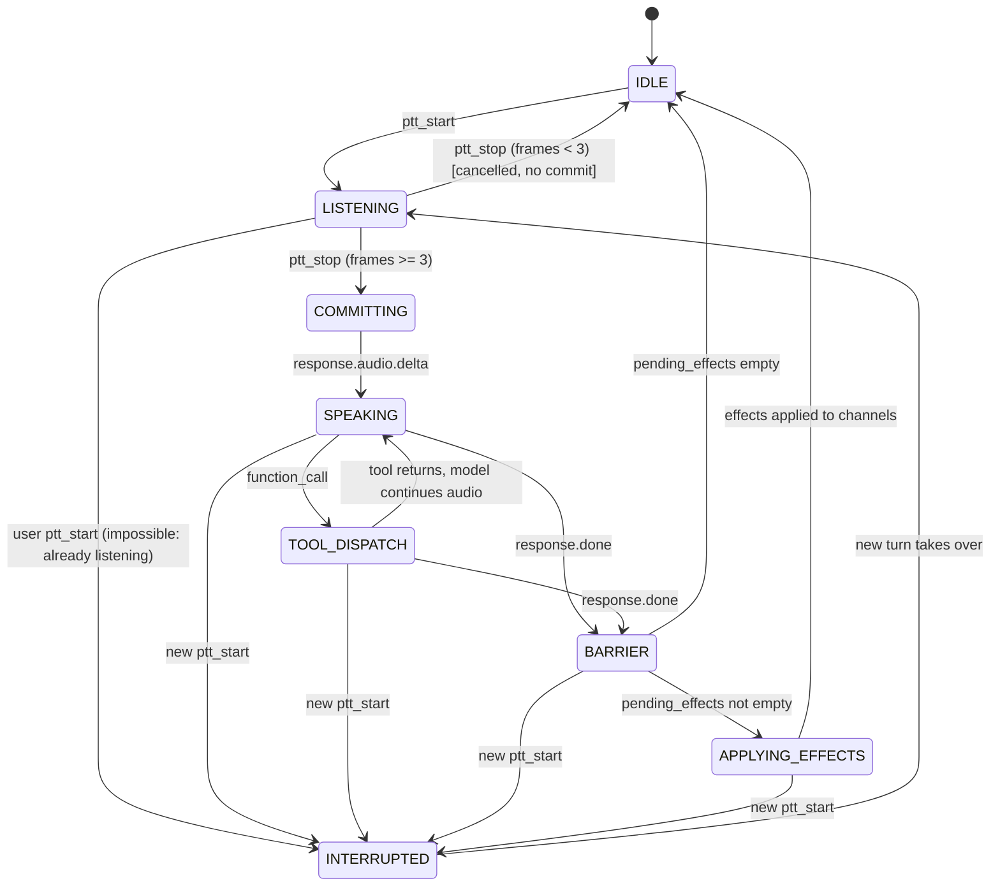

# Turn-based Audio Coordination

> **Status**: design spec, not yet implemented. The current code uses ad hoc coordination across `session/manager.py`, `app.py`, and `skills/audiobooks.py`. This document replaces that approach. See also [`decisions.md` → _"Turn-based coordinator for voice tool calls"_](./decisions.md#2026-04-13--turn-based-coordinator-for-voice-tool-calls).

## Purpose

Answer the question: **when the user speaks, the model replies, and a tool wants to play a book — who decides in what order the audio streams play, and what happens when the user interrupts mid-sentence?**

The honest history is that we've answered this question five times, once per bug, each with a new flag or deferred callback. Every bug we shipped fixes for in April 2026 — book-jumps-in, double-ack, seek-overlap, interrupt-leakiness, instruction-leak — was a symptom of the same missing abstraction: _"a tool call's audio side effect is sequenced after the model's verbal acknowledgement in the same atomic user interaction."_ The pattern isn't per-tool. It's per-turn. This doc formalizes it.

## The contract, in one paragraph

Every user interaction is a **Turn**. A Turn owns an ordered sequence of **AudioChannel** writes: the model's speech is written to the `speech` channel first, and any tool-produced audio (an audiobook, a music clip, a news headline) is written to the `media` channel only after the speech channel drains. Interrupts flush both channels atomically. Tools never touch playback directly — they declare an **AudioEffect** (start, modify, clear, none) and the **TurnCoordinator** orchestrates timing. Skill authors stop thinking about audio coordination entirely.

## The primitives

Four types, none of them exist in code yet:

### 1. `Turn` — the atomic unit of interaction

```python
class Turn:
    id: UUID
    state: TurnState
    user_audio_frames: int           # counted during ptt_start..ptt_stop
    model_response_id: str | None    # OpenAI response id once response.created fires
    pending_effects: list[AudioEffect]  # declared by tools during this turn, not yet fired
    started_at: float
    ended_at: float | None
```

A Turn is created on `ptt_start` and ends when all of these are true:

- User audio has been committed (`ptt_stop`) OR the press was cancelled (too-short tap)
- OpenAI has emitted `response.done` for the response following this commit
- Every pending `AudioEffect` has been applied to its channel (not completed — applied; see §3)

Turns are **strictly sequential**. A new `ptt_start` while a Turn is in flight raises the interrupt barrier, which flushes the current Turn and immediately starts a new one.

### 2. `AudioChannel` — named output stream

```python
@dataclass
class AudioChannel:
    name: Literal["speech", "media", "tone", "status"]
    queue: asyncio.Queue[bytes]
    current_source_task: asyncio.Task[None] | None
```

Each channel owns its own PCM queue and has its own `nextTime` cursor on the client side. The four channels and their semantics:

| Channel  | Used for                                    | Sequenced after  | Interrupt behavior              |
| -------- | ------------------------------------------- | ---------------- | ------------------------------- |
| `speech` | OpenAI model voice                          | —                | Flushed on user PTT start       |
| `media`  | Audiobook, music, news clip                 | `speech`         | Flushed on user PTT start       |
| `tone`   | Beeps / ready cue / error cue               | preempts nothing | Not flushed (never interrupted) |
| `status` | Spoken status for the ESP32 hardware client | none             | Cleared on state change         |

The **speech-before-media** rule is the core invariant. Within a single Turn, every byte of the `speech` channel plays before the first byte of the `media` channel. Cross-turn, channels drain naturally — the previous turn's `media` stream keeps playing until the next PTT press flushes it.

### 3. `AudioEffect` — what a tool declares it wants to do

```python
class EffectKind(Enum):
    NONE = "none"              # no audio impact (system.get_current_time)
    START_STREAM = "start_stream"   # begin a new media stream (play_audiobook)
    MODIFY_STREAM = "modify_stream" # replace current stream with new one (rewind/forward/resume)
    CLEAR_STREAM = "clear_stream"   # stop the current stream (stop)

@dataclass
class AudioEffect:
    kind: EffectKind
    channel: Literal["media"]  # v1: only media. v2: any channel.
    factory: Callable[[], AsyncIterator[bytes]] | None = None
```

**A tool's `handle()` returns an `AudioEffect` alongside its `ToolResult`.** The factory is a callable that, when invoked, returns an async iterator yielding PCM16 24 kHz mono chunks. The factory is NOT invoked by the skill — it's invoked by the `TurnCoordinator` at the right moment (after the speech channel drains). This is the critical decoupling: the skill declares _"I will produce this stream"_, the coordinator decides _when_.

**`START_STREAM` and `MODIFY_STREAM` are the same primitive under the hood.** Both stop any existing source on the channel, wait for the speech barrier, then invoke the factory. The only difference is semantic: `MODIFY_STREAM` signals "I know there's a current stream, I'm replacing it" (the coordinator logs this distinction for dev observability), while `START_STREAM` assumes a fresh channel. Implementation is shared.

**`CLEAR_STREAM`** stops the current source and leaves the channel idle. Used by `audiobook_control(action="stop")`.

**`NONE`** is the default — the tool has no audio side effect. Used by `system.set_volume`, `system.get_current_time`, and `search_audiobooks`.

### 4. `InterruptBarrier` — first-class interrupt semantics

```python
class InterruptBarrier:
    """One rule, atomic, one entrypoint."""

    async def raise_for_user_input(self, turn: Turn) -> None:
        await self.flush_channel("speech")
        await self.flush_channel("media")
        await self.cancel_pending_effects(turn)
        await self.cancel_model_response(turn)
        turn.state = TurnState.INTERRUPTED
```

Called from exactly one place: when a new `ptt_start` arrives while a Turn is in flight. Not called piecewise from three different layers like today. The barrier is atomic — no partial states, no "the server cancelled but the client queue still has audio", no "the model stopped but the ffmpeg subprocess is still emitting."

## Turn lifecycle



The key states:

- **LISTENING**: user is holding PTT, mic audio is streaming to OpenAI's input buffer
- **COMMITTING**: `ptt_stop` fired, server sent `input_audio_buffer.commit + response.create`, awaiting first audio delta from OpenAI
- **SPEAKING**: OpenAI is streaming response audio to the `speech` channel
- **TOOL_DISPATCH**: OpenAI emitted a function call; skill handling it; returns `ToolResult + AudioEffect`; model may continue speaking after
- **BARRIER**: `response.done` received; waiting to apply any staged `AudioEffect`s now that speech channel can drain
- **APPLYING_EFFECTS**: each pending effect is invoked in declaration order; `factory()` is called, its chunks flow into the target channel's queue
- **IDLE**: Turn is complete; waiting for next `ptt_start`

## Concrete decisions (answering the 10 questions)

These are the places my first sketch was hand-wavy. Each has a defensible choice and a flag for _"revisit if this bites."_

### 1. When does a Turn start and end?

- **Start**: on `ptt_start`. Before any mic audio flows. The Turn object is allocated and reachable for the interrupt barrier from this moment.
- **End**: when `state == IDLE` is reached — i.e. `response.done` has fired AND all `pending_effects` have been invoked (factory called, stream started on channel). We do not wait for streams to _complete_ — they're long-lived and outlive the Turn.

### 2. What does "speech done" mean?

Operationally: `response.done` from OpenAI. Not `response.audio.done` (which fires per audio item; a response can contain multiple audio items interleaved with tool calls). The barrier uses `response.done` as its gate.

### 3. `MODIFY_STREAM` vs `START_STREAM` — is there real overlap risk?

No. Both go through the barrier. Implementation:

```
on_apply_effect(effect):
    if channel.current_source_task:
        await channel.current_source_task.cancel()
    channel.current_source_task = spawn(consume_factory(effect.factory, channel))
```

The current source is cancelled and the new one starts inside the APPLYING_EFFECTS state, AFTER the speech channel has drained. There is no window where both the old `media` source and the new one emit simultaneously.

### 4. Factory contract

```python
Factory = Callable[[], AsyncIterator[bytes]]
```

- **Invocation**: called exactly once per effect, by the coordinator, inside `APPLYING_EFFECTS`
- **Yields**: PCM16 little-endian, 24 kHz, mono; any chunk size (coordinator doesn't care)
- **Pacing**: the factory is responsible for realtime pacing (ffmpeg `-re`, or explicit `asyncio.sleep`). The coordinator does NOT rate-limit; it forwards chunks as they arrive
- **Cancellation**: the async iterator MUST honor cancellation cleanly. If it spawns a subprocess, the subprocess must be killed on cancel. This is a contract on the factory author, enforced by a test
- **Completion**: natural EOF (StopAsyncIteration) is fine. The coordinator marks the channel idle when the iterator exhausts
- **Errors**: exceptions raised by the factory are caught by the coordinator, logged, and surfaced as an audible error tone on the `tone` channel (see §8)

### 5. Rapid PTT / concurrent turns

**Rule**: at most one Turn is active at any time. A second `ptt_start` while a Turn exists calls `InterruptBarrier.raise_for_user_input(current_turn)`, which:

1. Flushes `speech` and `media` channels (client drops queued audio via `audio_clear`)
2. Cancels pending effects on the current turn (factories never called)
3. Cancels the current model response (`response.cancel` to OpenAI)
4. Marks the current turn `INTERRUPTED`
5. Returns

Then a new Turn starts with the new `ptt_start`. Old turn is garbage-collectable.

**Storage side effects are non-transactional by design.** If `_play(book_id=X)` ran and persisted `last_audiobook_id=X` before the interrupt, that write stays. Reasoning: "last audiobook the user _intended_ to play" is a meaningful value; a user who said "pon X" then changed their mind has still indicated a preference for X over whatever came before. Accepting eventual consistency here avoids a rollback model that would be the first genuinely hard piece of state management in the codebase. **Revisit** if we see user confusion from this.

### 6. Protocol versioning

The `audio` WebSocket message gains an optional `channel` field:

```json
{ "type": "audio", "channel": "media", "data": "<base64 PCM16>" }
```

- **Backward compatibility**: omitting `channel` defaults to `"speech"`. The browser client can be updated incrementally; legacy code paths keep working.
- **`audio_clear`** gains a `channel` field with the same default:

```json
{ "type": "audio_clear", "channel": "speech" }
{ "type": "audio_clear", "channel": "all" }
```

The `"all"` value is shorthand for "flush every channel" — used by the interrupt barrier.

- **Client-side queues**: the browser's `AudioPlayback` grows per-channel state (`Map<channel, { nextTime, activeSources }>`). Each incoming audio chunk is routed by channel; each flush targets a channel by name.

- **ESP32 future**: starts from scratch with the new protocol. No migration.

### 7. Session vs Turn lifetime — do we remove the `PLAYING` state?

**Yes**, proposed. The `PLAYING` state in the current state machine conflates two things: _"a media stream is playing"_ (a channel state) and _"the OpenAI session is disconnected to save API cost"_ (a session state).

With the turn model, media playback is channel state, tracked inside `AudioRouter`. The session state machine simplifies to:

```
IDLE ─ wake_word → CONNECTING ─ connected → CONVERSING ─ disconnect/timeout → IDLE
```

Three states, two transitions per non-terminal. No `PLAYING`.

**Cost check**: OpenAI Realtime API bills per token (audio in, audio out, text in/out, cache read/write). An open session with no audio flowing emits zero tokens. Idle session = zero cost. The original justification for disconnecting on PLAYING ("save API cost") does not hold — we weren't saving anything but the WebSocket connection itself, and that has no pricing. **Confirmed by re-reading [pricing](https://platform.openai.com/docs/pricing)**: Realtime is priced per token only, no per-minute connection fee.

**Flag**: if OpenAI changes this pricing model in the future, we reinstate PLAYING. Not a near-term concern.

**Consequence**: the audiobook plays while the OpenAI session stays connected in CONVERSING. When grandpa presses the button mid-book, we're already in CONVERSING — no reconnection needed. First-press latency drops from ~1s (CONNECTING) to ~0s (already CONVERSING). Big UX win.

### 8. Error handling inside a Turn

If a factory raises mid-stream:

- **v1**: catch in the coordinator, log the exception, flush the affected channel, emit an error tone (distinct from the ready tone — lower pitch, e.g. 220 Hz for 200 ms), add a status message. Grandpa hears the tone + silence where the book should be. Not great, but not a crash.
- **v2**: the coordinator re-opens the OpenAI session (if closed) and injects a synthetic user message _"el reproductor falló"_, letting the model recover conversationally ("Perdón don, algo pasó con el libro. ¿Intento otra vez?"). Requires a "re-enter conversation after error" affordance.

v1 is good enough. Gap tracked in `skills/audiobooks.md`.

### 9. How does the `system` skill fit?

Trivially. `set_volume` and `get_current_time` declare `AudioEffect.kind = NONE`. When their tool call lands:

- Skill dispatched, `ToolResult` returned, no effect queued
- Coordinator sends `function_call_output` to OpenAI
- Since no effect is pending and the turn hasn't hit `response.done` yet, the coordinator calls `response.create` so the model can narrate the result
- Model speaks, `response.done` fires, turn ends

This is the _"non-terminal"_ path. The coordinator distinguishes it from the _"terminal"_ path (start/modify/clear stream) by whether the pending_effects list is non-empty.

Note: for non-terminal tools the model still pre-narrates IF the tool description tells it to. For `get_current_time` we probably don't want a pre-narration (the result IS the narration). For `set_volume` we might want "listo, don" afterwards. This is per-tool, lives in the tool description, not in the coordinator.

### 10. Test strategy

| Layer                            | Unit-testable? | How                                                                                                                                 |
| -------------------------------- | -------------- | ----------------------------------------------------------------------------------------------------------------------------------- |
| Skill → `AudioEffect` mapping    | ✅             | Call `handle()`, assert on returned `ToolResult` and effect                                                                         |
| `TurnCoordinator` state machine  | ✅             | Mock OpenAI session + channels, drive events (ptt_start, response.audio.delta, response.done, function_call), assert state sequence |
| `AudioChannel` queueing          | ✅             | Feed chunks, assert ordering, assert flush empties queue                                                                            |
| `AudioRouter` sequencing         | ✅             | Drive speech then media into one turn, assert media chunks emit only after speech done                                              |
| `InterruptBarrier`               | ✅             | Drive mid-turn ptt_start, assert atomic flush + new turn starts                                                                     |
| ffmpeg factory (real subprocess) | ⚠️ integration | `@pytest.mark.integration`, needs ffmpeg installed                                                                                  |
| End-to-end OpenAI turn           | ⚠️ integration | `@pytest.mark.integration`, needs API key                                                                                           |
| Browser-side per-channel queues  | ❌             | Manual smoke. No DOM-level unit test in scope for v1.                                                                               |

**Count target**: ~30 new unit tests across the 5 unit-testable layers. Most existing `session/manager.py` tests become invalid and are replaced. Most `audiobooks` skill tests survive with light edits (same assertions, new `AudioEffect` return value).

## Protocol delta — exactly what changes on the wire

### Server → client (additions)

| Message       | Change                                                                                                                |
| ------------- | --------------------------------------------------------------------------------------------------------------------- |
| `audio`       | Add optional `channel: "speech" \| "media" \| "tone" \| "status"` (default `"speech"`)                                |
| `audio_clear` | Add optional `channel` with same values + `"all"` (default `"all"` for backward compat with current usage)            |
| `state`       | Value set changes: removes `"PLAYING"`, keeps `"IDLE" \| "CONNECTING" \| "CONVERSING"`                                |
| `turn`        | **New**: `{ "type": "turn", "event": "start" \| "end" \| "interrupted", "turn_id": "uuid" }`. Dev observability only. |

### Client → server

No changes. `ptt_start`, `ptt_stop`, `wake_word`, `audio` stay as-is.

### Removed messages

None. All current messages retain meaning.

## Code shape — what gets added and what disappears

### New files

```
server/src/abuel_os/
├── audio/
│   ├── __init__.py
│   ├── channel.py          # AudioChannel + AudioRouter
│   └── effect.py           # AudioEffect, EffectKind
├── turn/
│   ├── __init__.py
│   ├── coordinator.py      # TurnCoordinator, Turn, TurnState
│   └── barrier.py          # InterruptBarrier
```

### Deleted / heavily trimmed

- `session/manager.py`: `_pending_tool_action`, `_pending_action_task`, `_response_cancelled`, `_fire_pending_action`, the entire `_handle_function_call` orchestration block. Reduced to "connect, send, receive-and-dispatch-to-coordinator." Probably -150 lines.
- `app.py`: `_on_audiobook_chunk`, `_on_audiobook_finished`, `_on_audio_clear`, `_assistant_speaking` flag, pre-PTT player-stop logic, the `_enter_playing`/`_exit_playing` callbacks, `_on_wake_word` audiobook-stop logic. Application becomes mostly wiring: "create coordinator, create skills, connect." Probably -100 lines.
- `skills/audiobooks.py`: `_control` delegation hack, all `paused=True` / resume-in-enter-playing logic, `_current_or_last_book_id` fallback. Probably -60 lines.
- `media/audiobook_player.py`: `on_audio_clear` callback, `seek()` method reinvention, pause event. Player becomes a factory: `AudiobookPlayer.stream(path, start_position)` → `AsyncIterator[bytes]`. Probably -50 lines.
- State machine: `PLAYING` state + its transitions removed. Probably -30 lines.

### Net

- **New code**: ~400-500 lines (coordinator, channel, effect, barrier, tests)
- **Deleted code**: ~350-400 lines
- **Net**: approximately even, but qualitatively: repeated ad-hoc coordination → one well-defined abstraction. Future skills (news, music, messaging) cost ~30 lines each instead of ~150.

## Migration plan — step-by-step

Order matters. Each step should leave the repo in a working state with green tests.

### Step 1 — Add types, nothing is used yet

- Create `audio/effect.py` (`AudioEffect`, `EffectKind`)
- Create `audio/channel.py` (`AudioChannel`, `AudioRouter` stubs)
- Create `turn/coordinator.py` (`Turn`, `TurnState`, `TurnCoordinator` stubs)
- Create `turn/barrier.py` (`InterruptBarrier` stub)
- **Green DoD**: ruff, mypy, all existing tests still pass; no wiring yet

### Step 2 — `AudioChannel` + `AudioRouter` working, not wired

- Implement real queue/flush/send logic
- Write unit tests for channel ordering and flushing
- No one calls it yet
- **Green DoD**: new tests pass; existing behavior unchanged

### Step 3 — `TurnCoordinator` working against a fake OpenAI session

- Drive events manually in tests (ptt_start, audio delta, function call, response.done)
- Assert state transitions, pending effect handling, barrier behavior
- Still no wiring in app.py
- **Green DoD**: coordinator tests pass; existing behavior unchanged

### Step 4 — Wire the coordinator into `app.py` and `session/manager.py`

- `session/manager.py` becomes a thin transport: receive events, forward to coordinator
- `app.py` owns the coordinator, passes it to session manager
- Old defer/pending/flag logic removed
- Audiobook skill temporarily broken — next step
- **Green DoD**: coordinator unit tests pass, old session tests fail (expected)

### Step 5 — Migrate the audiobooks skill

- `AudiobooksSkill._play()` returns `(ToolResult, AudioEffect)` instead of `ToolResult(action=...)`
- `_control` collapses back to flat dispatch (no delegation to `_play`)
- `AudiobookPlayer.stream(path, start)` becomes a factory
- Update `skills/__init__.py` protocol to include `handle()` returning both
- **Green DoD**: audiobook unit tests updated + pass; old `action=START_PLAYBACK` codepaths removed

### Step 6 — Client per-channel queues

- `web/src/lib/audio/playback.ts`: `AudioPlayback.play(channel, data)` signature change, per-channel `nextTime`
- `web/src/lib/ws.svelte.ts`: route incoming `audio` messages by channel
- `web/src/routes/+page.svelte`: no changes (the button still does what it does)
- **Green DoD**: `bun run check` green, manual smoke test passes

### Step 7 — Remove `PLAYING` state

- `state/machine.py`: drop PLAYING and its transitions
- `app.py`: drop `_enter_playing`, `_exit_playing`
- Update `docs/architecture.md` state machine diagram
- Update `docs/protocol.md` state enum
- **Green DoD**: all tests pass; new ADR appended

### Step 8 — Docs refresh + final manual smoke

- Update `architecture.md` with the new coordinator section
- Update `skills/README.md` with the new `handle()` signature
- Update `skills/audiobooks.md` current-state audit (most gaps close)
- Manual smoke test: play, pause (via voice), resume, rewind, forward, interrupt mid-speech, interrupt mid-book, rapid PTT

**Total wall-clock estimate**: 2-3 focused days for steps 1-7, plus a half day for docs and smoke. The revised estimate (vs my earlier "~1 day") is honest — the step-by-step structure is the realistic scope.

## Open questions deferred to v2 or later

Things I am explicitly NOT answering in this spec, with the reason:

- **Rollback of storage side effects on interrupted turns.** Accepted as eventual consistency per §5. Reopen if user confusion surfaces.
- **Audible error recovery mid-stream.** v1 does tone + silence; v2 does re-inject into conversation. Gap tracked in `skills/audiobooks.md`.
- **Multi-stream media** (e.g. background music under a news clip). Channels support it architecturally but no v1 use case.
- **Priority preemption across channels** (e.g. a "critical" status cutting speech). v1 has simple sequencing, not priorities. Add when reminders / proactive speech land.
- **Persistent turn history** (replay, debugging). Not needed for v1. Dev events log individual tool calls; that's enough.
- **Coordinator distributed across processes** (e.g. running on Pi while server is elsewhere). v1 is in-process.
- **Non-audio effects** (side effects to storage, external API calls). These happen naturally inside `handle()` — the effect type system only models _audio_ side effects because audio is what needs coordination.
- **Tool chains** (tool A's output triggers tool B). v1 lets the LLM do this via multiple turns — each function call within a response is processed; if the LLM decides to call another tool, that's the next iteration of the receive loop. The coordinator does not need special support.

## Source-of-truth pointers

When the code lands, these files are the canonical reference for each primitive:

| Concept                                | File                                            |
| -------------------------------------- | ----------------------------------------------- |
| `Turn`, `TurnState`, `TurnCoordinator` | `server/src/abuel_os/turn/coordinator.py`       |
| `InterruptBarrier`                     | `server/src/abuel_os/turn/barrier.py`           |
| `AudioChannel`, `AudioRouter`          | `server/src/abuel_os/audio/channel.py`          |
| `AudioEffect`, `EffectKind`            | `server/src/abuel_os/audio/effect.py`           |
| `Skill.handle()` new signature         | `server/src/abuel_os/types.py`                  |
| Protocol delta (wire format)           | `docs/protocol.md` (update in migration step 6) |
