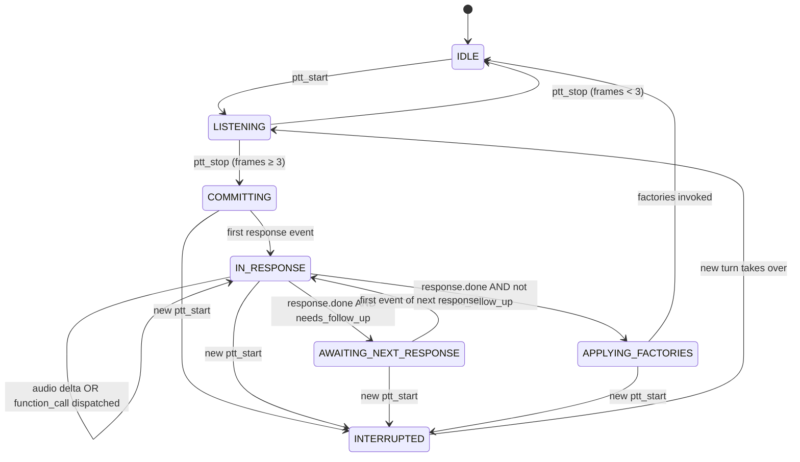

# Turn-based Audio Coordination

> **Status**: **implemented** — landed across 6 staged commits on 2026-04-14 (steps 1–6). Spec history: v1 was under-specified (first critic round caught it); v2 over-engineered the audio layer with a named-channel abstraction that had no v1 consumer (self-review caught it after two critic rounds); v3 cuts the channels and ships. Same root-cause fix, ~40% less ceremony than v2. See [ADR — 2026-04-13 — Turn-based coordinator for voice tool calls](./decisions.md#2026-04-13--turn-based-coordinator-for-voice-tool-calls), and the source: [`server/src/abuel_os/turn/coordinator.py`](../server/src/abuel_os/turn/coordinator.py).

## Purpose

Answer the question: **when the user speaks, the model replies with a mix of audio and tool calls — possibly across multiple model responses — and a tool wants to play a book, who decides the audio playback order, and what happens when the user interrupts mid-sentence?**

Every audio-coordination bug in April 2026 — _book-jumps-in_, _double-ack_, _seek-overlap_, _interrupt-leakiness_, _instruction-text-leak_ — was a symptom of one missing abstraction: _"a user-assistant exchange is a Turn; a Turn owns a strict audio ordering; a Turn's side effects fire only after the model is completely done talking."_ This doc defines that abstraction — no more, no less.

## The contract, in one paragraph

Every user interaction is a **Turn**. A Turn owns one ordering: all of the model's speech (across as many chained OpenAI responses as the model needs to handle info tools) plays first, then any tool-produced audio factories fire in declaration order. The coordinator forwards both kinds of chunks to the same `server.send_audio` pipe in that order — there is no parallel mixing, no per-source queue, no channel abstraction. Tools never touch playback; they return a `ToolResult` with an optional `audio_factory` callable that the coordinator invokes at the right moment. Interrupts atomically flush the client queue, cancel any long-running media task, and cancel the OpenAI response. A client-side **thinking tone** fills any silence longer than 400 ms so a blind user never hears dead air.

## Why v3 is smaller than v2

v2 proposed named audio channels (`speech`, `media`, cut to just those two after the first critic pass), per-channel client queues, an `AudioRouter`, a required `channel` field on the `audio` WebSocket message, and an `EffectKind` enum with `START_STREAM`/`CLEAR_STREAM`/`NONE` values. All of this was architected for a **future** use case (concurrent audio sources — music under news, priority preemption, selective channel flushing) that has no v1 consumer. The actual v1 problem is one-dimensional **sequencing**: _"speech first, then tool audio, in the same turn."_ Sequencing is a coordinator responsibility; it doesn't need a channel model. v3 keeps every substantive bug fix from v2 and cuts the channel ceremony.

**What v3 cuts (zero v1 capability lost)**:

- `AudioChannel` type → gone
- `AudioRouter` → gone
- `EffectKind` enum (`NONE`/`START_STREAM`/`CLEAR_STREAM`) → gone; replaced by `audio_factory: Callable | None` on `ToolResult`
- `channel` field on `audio` and `audio_clear` WebSocket messages → gone; the protocol stays near-unchanged
- Per-channel client-side queues in `playback.ts` → gone; `AudioPlayback` stays as it is today
- Separate `InterruptBarrier` class → gone; interrupt becomes an atomic method on `TurnCoordinator`
- `BARRIER` state as a distinct state → collapsed into the `IN_RESPONSE → APPLYING_EFFECTS` transition

**What v3 keeps (everything that was a real bug fix)**:

- `TurnCoordinator` with its full state machine for chained responses
- The factory pattern (skill declares, coordinator invokes after all model speech)
- Atomic interrupt semantics with the `response_cancelled` drop flag preserved
- Mid-chain interrupt rule (interrupted turns drop all accumulated factories)
- Closure-captured new position for rewind/forward (no premature storage writes)
- `PLAYING` state removal from the session state machine
- Client-side thinking tone anchored on existing protocol signals

## The primitives — three, not four

### 1. `Turn` — the atomic unit of interaction

```python
class Turn:
    id: UUID
    state: TurnState
    user_audio_frames: int
    response_ids: list[str]
    pending_factories: list[Factory]   # accumulated across all responses in this turn
    needs_follow_up: bool              # per-response flag: set when a None-factory tool was called in the current response
    started_at: float
    ended_at: float | None
```

Allocated on `ptt_start`, ends when `state == IDLE` is reached. Strict sequential — at most one active Turn at any time.

**Latching rules for `pending_factories`**:

- **Appended** during `IN_RESPONSE`: every function call whose `ToolResult.audio_factory is not None` has its factory appended.
- **Fired** only on the terminal state transition at the end of the chain (after the last `response.done` with no follow-up needed), in declaration order. Each factory is invoked, its chunks forwarded to `server.send_audio`.
- **Cleared** on interrupt — an interrupted turn's factories are dropped, never invoked.

**`needs_follow_up` latching**:

- **Set** when a function call with `audio_factory=None` is dispatched during the current response.
- **Cleared** at the start of each new response in the chain (set fresh for each round's tools).
- **Read** on `response.done`: if set, send `response.create` to request a follow-up narration round; if unset, terminate the turn.

### 2. The factory pattern

The skill protocol grows one optional field on `ToolResult`:

```python
@dataclass(frozen=True, slots=True)
class ToolResult:
    output: str
    audio_factory: Callable[[], AsyncIterator[bytes]] | None = None
```

Semantics:

- **`audio_factory is None`** — info tool. The model needs to narrate the tool output in a follow-up response. Example: `get_current_time`, `search_audiobooks`, `set_volume`.
- **`audio_factory is not None`** — side-effect tool. The model pre-narrates before calling (per tool description). After all model speech in the turn, the coordinator invokes the factory, iterates the async iterator, and forwards PCM chunks to `server.send_audio` as a long-running task. Example: `play_audiobook`, `audiobook_control` for rewind/forward/resume.

No separate `AudioEffect` wrapper type, no `EffectKind` enum. The presence or absence of the factory is the signal.

**The coordinator owns one field for a long-running media stream**:

```python
current_media_task: asyncio.Task[None] | None
```

This is the task running `async for chunk in factory(): await send_audio(chunk)`. It outlives turns — an audiobook started in one turn keeps playing until the next turn's interrupt. When a new factory is applied, the coordinator cancels any existing `current_media_task` first, then spawns the new one. Single slot, not a channel abstraction. No queue.

**Factory contract** (unchanged from v2):

- **Invocation**: called exactly once, by the coordinator, inside the turn's terminal state.
- **Yields**: PCM16 little-endian, 24 kHz, mono; any chunk size.
- **Pacing**: the factory is responsible for realtime pacing (ffmpeg `-re`, explicit `asyncio.sleep`).
- **Cancellation**: the iterator MUST honor cancellation cleanly. On `task.cancel()`, the iterator's next `yield` must tear down any subprocess / file / network resource.
- **Completion**: natural EOF (`StopAsyncIteration`) is fine; the coordinator marks `current_media_task = None`.
- **Errors**: exceptions caught by the coordinator, logged, surface a distinct error tone client-side + status message. **Tested via integration test with a real subprocess**, not unit mock.

**Critical: closure-captured new position for rewind/forward**. The skill does not write `saved_position = new_pos` to storage during dispatch. The new position lives in the factory closure: `lambda: player.stream(path, start=new_pos)`. If the turn is interrupted, the factory is never invoked, and storage is untouched — the stored position still reflects last _actually played_ position, not last _requested_ seek. This fixes an interrupt-atomicity gap in the current code.

### 3. Interrupt — an atomic method on `TurnCoordinator`

Not a separate class. One method with an explicit step order — replaces three layers of hand-rolled partial clearing in the current code.

```python
class TurnCoordinator:
    response_cancelled: bool   # drop flag — step 1 below

    async def interrupt(self) -> None:
        """Raised on a new ptt_start mid-turn, or on state → IDLE."""
        # Order matters. Do not reorder without updating this doc.
        self.response_cancelled = True                      # 1. drop flag FIRST
        if self.current_turn:
            self.current_turn.pending_factories.clear()     # 2. drop pending factories
        await self.server.send_audio_clear()                # 3. flush client queue
        if self.current_media_task:                         # 4. cancel long-running producer
            self.current_media_task.cancel()
            with contextlib.suppress(asyncio.CancelledError):
                await self.current_media_task
            self.current_media_task = None
        if self.session.is_connected:                       # 5. cancel model response
            await self.session.cancel_response()
        if self.current_turn:
            self.current_turn.state = TurnState.INTERRUPTED # 6. mark turn
```

**Rationale for step 1 (drop flag first)**: OpenAI audio deltas arrive asynchronously. Between "we sent `response.cancel`" and "OpenAI actually processed it," more deltas can land. The receive loop checks `response_cancelled` before forwarding each delta — if set, the delta is dropped at the receive point. Without the flag, flush + cancel is not atomic: stale deltas could re-fill a just-flushed client queue.

This is **not** a new invention — `session/manager.py:82` has the same flag today. The coordinator takes ownership of it; session manager becomes thin transport.

## Turn lifecycle



**7 states** (down from v2's 8 — the v2 `BARRIER` state was a decision point with no intrinsic behavior, so it's collapsed into the `IN_RESPONSE → APPLYING_FACTORIES` transition).

Key transitions:

- **IN_RESPONSE → AWAITING_NEXT_RESPONSE**: `response.done` arrives AND `needs_follow_up == True` (at least one tool this round had `audio_factory=None`). Coordinator sends `response.create` and clears `needs_follow_up` for the next round.
- **IN_RESPONSE → APPLYING_FACTORIES**: `response.done` arrives AND `needs_follow_up == False`. The model has fully finished talking for this turn. If `pending_factories` is non-empty, invoke them in order; if empty, transition directly to `IDLE`.
- **AWAITING_NEXT_RESPONSE → IN_RESPONSE**: first event of the new response.
- **APPLYING_FACTORIES → IDLE**: each pending factory has been invoked. Long-running factories (`current_media_task`) run in the background; the turn doesn't wait for them to complete.
- **Any state → INTERRUPTED**: new `ptt_start` during a live turn calls `coordinator.interrupt()`.

## Concrete decisions

The 10 questions the first critic round flagged as hand-wavy. v3 answers, often shorter than v2 because the channel layer is gone.

### 1. When does a Turn start and end?

- **Start**: on `ptt_start`. Turn allocated immediately, reachable for interrupt from this moment.
- **End**: `state == IDLE`. Long-running factories outlive the Turn — the turn ends when they're _invoked_, not when they _complete_.

### 2. What does "speech done" mean?

The terminal `response.done` of the chain — one that leaves `needs_follow_up == False`. For a simple turn with one response and a side-effect tool, this is the single `response.done`. For a chained turn (info tool → narration → more), it's the final response's `response.done`. The coordinator's decision rule: _"after each `response.done`, if `needs_follow_up` is set, send `response.create` and loop; else, transition to APPLYING_FACTORIES."_

### 3. `START_STREAM` vs `MODIFY_STREAM` — this question is now moot

No enum. No kinds. If a tool has a factory, the coordinator runs it. If `current_media_task` already exists, it's cancelled first. Whether that's _starting fresh_ or _modifying_ is semantics for the tool description, not for the runtime.

### 4. Factory contract

See "The factory pattern" above. Unchanged from v2.

### 5. Rapid PTT / concurrent turns / mid-chain interrupts

**Rule**: at most one Turn is active. A new `ptt_start` while a Turn exists calls `coordinator.interrupt()` (see §"Interrupt" above), then a new Turn starts.

**Mid-chain interrupts**: if a turn has three chained responses and the user interrupts in response 2, all factories accumulated from responses 1 and 2 are dropped. An interrupted turn is always fully cancelled — no partial factory application.

**Storage side effects are non-transactional by design.** If the skill wrote `last_audiobook_id = X` to storage during `handle()`, that write stands. Rollback would need a transaction model — deferred.

**Rewind/forward** no longer write positions to storage during dispatch. Positions live in factory closures; an interrupted rewind = untouched storage.

### 6. Protocol delta

**Tiny**. The channel layer is gone, so `audio` and `audio_clear` messages stay as they are today. The only changes:

- **`state` message**: value set removes `"PLAYING"`, keeps `"IDLE" \| "CONNECTING" \| "CONVERSING"`
- **`turn` message** (new, optional): `{ "type": "turn", "event": "start" \| "end" \| "interrupted", "turn_id": "uuid" }` — dev observability only; the browser client uses it to tag events in the dev panel; the ESP32 client can ignore it

Everything else (`audio`, `audio_clear`, `status`, `transcript`, `model_speaking`, `dev_event`) is unchanged on the wire.

### 7. Session vs Turn lifetime — `PLAYING` state removed

Session state machine simplifies to:

```
IDLE → CONNECTING → CONVERSING → IDLE
```

No `PLAYING`. Media playback is tracked by `current_media_task` on the coordinator, not by the session state machine.

**Cost check**: OpenAI Realtime API bills per token. Idle session (no audio flowing, no function calls) = zero tokens = zero cost. The original "save API cost" justification for PLAYING does not hold.

**Mic privacy unchanged**: mic-to-OpenAI forwarding is gated by `_ptt_active`, independent of state. Removing PLAYING does not change what grandpa's mic streams.

**UX win**: first-press latency after a mid-book interrupt drops from ~1 s (reconnection) to ~0 s (session already open).

### 8. Error handling inside a Turn

- **v1**: catch exceptions in the consumer task, log, stop the factory, emit a distinct error tone client-side + status message. Grandpa hears the tone + silence.
- **v2 (of this spec)**: coordinator re-opens the session and injects a synthetic user message `"el reproductor falló"` for conversational recovery. Deferred.

### 9. `system` skill + the `audio_factory=None` path in detail

`system.set_volume` and `system.get_current_time` return `ToolResult(audio_factory=None)`. Flow:

1. **IN_RESPONSE** — skill dispatched, result returned. `needs_follow_up = True`. `pending_factories` unchanged.
2. Coordinator sends `function_call_output` to OpenAI.
3. On `response.done`: `needs_follow_up` is set → `AWAITING_NEXT_RESPONSE`. Coordinator sends `response.create`, clears `needs_follow_up`.
4. First event of the new response → `IN_RESPONSE`. Model generates audio narrating the result.
5. On this response's `response.done`: no tools dispatched this round, `needs_follow_up` is still False → `APPLYING_FACTORIES`. `pending_factories` is empty → direct to `IDLE`.

**Mixed response with both a factory tool AND a None-factory tool** (physically possible despite the system prompt rule):

1. Response 1 dispatches `play_audiobook` (factory appended) and `get_current_time` (None-factory; `needs_follow_up = True`).
2. `response.done` → `needs_follow_up` set → `AWAITING_NEXT_RESPONSE`. `response.create` sent.
3. Response 2 narrates the time. `needs_follow_up` stays False (no tools this round).
4. `response.done` → `APPLYING_FACTORIES` → invoke the pending factory → book plays → `IDLE`.

Ordering: pre-narration from response 1 → time narration from response 2 → book audio. Correct.

### 10. Test strategy

**Unit tests** (fast, deterministic):

| Layer                                                 | Tests                                                                                                                            |
| ----------------------------------------------------- | -------------------------------------------------------------------------------------------------------------------------------- |
| `TurnCoordinator` state machine                       | ~12 — one per transition, plus chained-response happy path, plus mid-chain interrupt, plus mixed factory+None tools              |
| `Turn.pending_factories` + `needs_follow_up` latching | ~6 — appends, clears, per-response reset                                                                                         |
| `TurnCoordinator.interrupt()`                         | ~4 — verify 6-step order, drop-flag-first, media task cancelled, session cancel called                                           |
| `AudiobooksSkill.handle()` returns correct factories  | ~18 — existing `test_audiobooks_skill.py` tests, assertions move from `result.action` to `result.audio_factory is None/not None` |
| `SessionManager` receive-loop routing                 | ~4 — event forwarding to coordinator, no own dispatch logic                                                                      |

Net unit tests: **~90** (up from 88 today; ~26 new coordinator/latching/interrupt tests, ~45 existing skill/storage/registry/state tests carried over, offset by ~15 deleted session-manager tests). **v2 projected ~100 tests** including channel tests that v3 doesn't need.

**Integration tests** (`@pytest.mark.integration`):

- `test_audiobook_player.py` — real ffmpeg, real subprocess, real cancellation. Verify the factory contract's cancellation guarantee.
- Full-turn happy path with real OpenAI session (requires `ABUEL_OPENAI_API_KEY`).

**Deleted tests**:

- `test_session_manager.py::test_function_call_dispatches_to_skill` — replaced by coordinator dispatch tests
- `test_session_manager.py::test_function_call_with_action_defers_orchestrator_notification` — replaced by coordinator's latching tests
- Any test asserting on `_pending_tool_action`, `_response_cancelled`, `_fire_pending_action` inside the session manager — behavior moves to the coordinator

**Surviving tests** (no change or trivial update):

- `test_state_machine.py` — unchanged library; only removes PLAYING transitions
- `test_storage.py` — entirely
- `test_skill_registry.py` — entirely
- `test_audiobooks_skill.py` — all tests; assertions updated for the new `ToolResult.audio_factory` field
- `test_config.py` — entirely

## Code shape

### New files

```
server/src/abuel_os/
└── turn/
    ├── __init__.py
    └── coordinator.py      # TurnCoordinator, Turn, TurnState, interrupt method
```

**One new directory, two new files** (down from v2's four). No `audio/` package. No separate `barrier.py`.

### Changed files

- `server/src/abuel_os/types.py` — `ToolResult` gains `audio_factory` field; `ToolAction` enum **removed** (it was only ever `NONE` and `START_PLAYBACK`); `Skill.handle()` signature unchanged at the Python level (same return type, richer field).
- `server/src/abuel_os/session/manager.py` — thin transport: receive event, forward to coordinator. `_pending_tool_action`, `_pending_action_task`, `_response_cancelled`, `_fire_pending_action`, and the whole `_handle_function_call` orchestration block deleted (the drop flag logic moves onto the coordinator).
- `server/src/abuel_os/app.py` — coordinator instantiation; `_on_audiobook_chunk` / `_on_audiobook_finished` / `_on_audio_clear` / `_enter_playing` / `_exit_playing` callbacks removed; `_assistant_speaking` flag removed; `_on_wake_word` audiobook-stop logic removed.
- `server/src/abuel_os/skills/audiobooks.py` — `_play` returns `ToolResult(..., audio_factory=lambda: ...)`. `_control` rewind/forward/resume use the same pattern; no more `_play` delegation hack.
- `server/src/abuel_os/media/audiobook_player.py` — `AudiobookPlayer.stream(path, start_position=0.0)` becomes the factory callable. `load()`/`seek()`/`pause()`/`on_audio_clear` all gone.
- `server/src/abuel_os/state/machine.py` — `PLAYING` state + its transitions + `_enter_playing`/`_exit_playing` callbacks removed.

### Unchanged files

- **`web/src/lib/audio/playback.ts`** — stays as-is, modulo the new `playThinkingTone()` method. No per-channel queues. No `play(channel, data)` signature change.
- **`web/src/lib/ws.svelte.ts`** — modulo adding the silence-detection timer for the thinking tone, no changes. No channel-field routing.
- **`web/src/routes/+page.svelte`** — zero changes from the one-button refactor.
- **Protocol message handlers** — `audio` and `audio_clear` on both sides stay as they are.

### Net LOC

- **New code**: ~300 lines (coordinator + turn + interrupt method + their tests)
- **Deleted code**: ~400 lines (v2 estimate held; the channel-layer code was never written so nothing to delete there, but the existing defer/pending/flag cruft still goes)
- **Net**: **approximately -100 lines** for v3 (v2 projected ~zero net). The repo ends up smaller, not the same size.

## Migration plan — **6 steps**

Down from v2's 8. Steps for "implement channel queue" and "client per-channel state" disappear because there are no channels.

### Step 1 — Add `audio_factory` field + coordinator stubs

- Add `audio_factory: Callable[[], AsyncIterator[bytes]] | None = None` to `ToolResult`
- Remove `ToolAction` enum (replace all usages with factory-or-None)
- Create `turn/coordinator.py` with empty class + type definitions
- **DoD**: ruff, mypy, all existing tests pass (audiobooks skill temporarily uses `audio_factory=lambda: ...` stubs or still uses the old action field until step 4; decide at implementation time)

### Step 2 — `TurnCoordinator` state machine against a fake OpenAI session

- Drive events manually in unit tests: `ptt_start`, audio delta, function call dispatch, `response.done`, `response.create` for chain, mid-chain interrupt
- Assert state transitions, factory latching rules, `needs_follow_up` flag behavior, `interrupt()` atomicity
- **DoD**: coordinator unit tests pass (~22 new tests across state machine + latching + interrupt)

### Step 3 — Wire the coordinator into `app.py` and `session/manager.py`

- `session/manager.py` becomes a thin transport: receive OpenAI events, forward to coordinator
- `app.py` owns the coordinator, passes it into session manager construction
- Old defer/pending/flag logic removed from `session/manager.py`
- Audiobooks skill temporarily broken (still returns `ToolResult(action=...)`) — fixed in step 4
- **DoD**: coordinator tests + session-manager routing tests pass; audiobook tests expected to fail

### Step 4 — Migrate the audiobooks skill to factories

- `AudiobooksSkill._play()` returns `ToolResult(..., audio_factory=lambda: AudiobookPlayer.stream(path, start=pos))`
- `_control` for rewind/forward/resume returns the same pattern with `start=new_pos` captured in the closure
- `_control` for pause/stop returns `audio_factory=None` (no effect)
- `AudiobookPlayer.stream(path, start_position)` becomes an async generator; `load()`/`seek()`/`pause()`/pause event / on_audio_clear callback deleted
- Update `test_audiobooks_skill.py` assertions
- **DoD**: audiobook unit tests pass

### Step 5 — Remove the `PLAYING` state

- `state/machine.py`: drop `PLAYING` and its transitions
- `app.py`: drop `_enter_playing`, `_exit_playing`, the state-transition observer that used to broadcast PLAYING
- `docs/architecture.md`: update state machine diagram
- `docs/protocol.md`: update `state` enum values
- **DoD**: all tests pass

### Step 6 — Client thinking tone + docs polish

- `web/src/lib/audio/playback.ts`: add `playThinkingTone()` method
- `web/src/lib/ws.svelte.ts`: silence-detection timer hooked to `ptt_stop` (sent) and `model_speaking: false` (received)
- Update `docs/turns.md` status from "spec v3, not yet implemented" to "implemented"
- Update `docs/architecture.md`: replace the "design in flight" note with the actual coordinator section
- Update `docs/skills/README.md`: new `ToolResult.audio_factory` documentation for skill authors
- Update `docs/skills/audiobooks.md`: current state audit (most gaps close)
- Manual browser smoke: play, pause, resume, rewind, forward, interrupt mid-speech, interrupt mid-book, rapid PTT, `¿qué hora es?` with thinking tone audible in the gap
- **DoD**: all tests pass; browser smoke passes; docs updated

**Total wall-clock**: 2 focused days for steps 1-5 (v2 was 2-3 because steps 2 and 6 existed), plus a half day for step 6 and smoke testing.

## The thinking tone — client-side gap filler

Unchanged from v2. For a blind user, silence longer than ~400 ms is indistinguishable from _"the device is broken."_

### Where it lives

**Entirely client-side.** Implemented in `web/src/lib/audio/playback.ts` as a new method `playThinkingTone()`. No server-side tone production, no new WebSocket message.

### When it starts

The client starts a 400 ms silence timer on either:

- **Send `ptt_stop`** — the initial gap while the coordinator commits, OpenAI processes, and the first audio delta arrives
- **Receive `model_speaking: false`** — an inter-round gap: the current round's audio item finished, another round may be coming

If 400 ms passes without either an `audio` message or a `model_speaking: true` message arriving, the tone starts.

### When it stops

With a ~20 ms linear fade to avoid clicks:

- Receive `audio` — content is arriving
- Receive `model_speaking: true` — audio imminent
- Any interrupt (user `ptt_start`, state transitions to IDLE, WebSocket disconnects)

### Duration bound

**No hard timeout.** The tone plays as long as silence persists. Server crashes bounded by the existing 2 s WebSocket reconnect logic.

### Sound design

| Tone             | Purpose                   | Frequency    | Envelope                                    |
| ---------------- | ------------------------- | ------------ | ------------------------------------------- |
| Ready (existing) | "Mic is live, speak now"  | 880 Hz       | Single burst, 90 ms, sharp attack + decay   |
| Thinking (new)   | "Processing, please wait" | 440 Hz       | Pulsing: 150 ms on, 250 ms off, soft attack |
| Error (deferred) | "Something broke"         | 440 → 220 Hz | Descending two-tone, 400 ms total           |

Grandpa learns three sounds at most. Audibly distinct.

### Interrupt behavior

The thinking tone is NOT carried across turns. On any interrupt, client stops the tone as part of the cleanup. A previous turn's tone never plays over a new turn's listening phase.

## Open questions

Deferred explicitly, with reason:

- **Transactional rollback on interrupt**: accepted as eventual consistency per §5. Revisit if user confusion surfaces.
- **Audible error recovery mid-stream**: v1 = tone + silence; v2 = conversational re-inject. Deferred.
- **Named channels / per-stream routing**: v3 deliberately cuts the channel layer because v1 has exactly one concurrent-stream rule to enforce (speech before media in a turn), and sequencing solves that without channels. **When we need multi-stream mixing** — background music under a news clip, priority preemption of speech by a critical alert, concurrent media during proactive speech — we add channels _then_. The cost of adding them later is approximately the cost of adding them now, and by then we'll know the actual use cases instead of speculating. The right trigger for the channel refactor: the first v2 skill that legitimately wants concurrent audio sources on the same client.
- **Priority preemption across channels** — same as above.
- **Persistent turn history** (replay, debugging): dev events suffice for v1.
- **Coordinator distributed across processes**: v1 is in-process.
- **Non-audio effects** (storage writes, external API calls): happen naturally inside `handle()`; the factory pattern only models _audio_ side effects.
- **Tool chaining with multiple function calls in one response**: OpenAI allows it. v1 dispatches each in order, accumulates factories, handles the NONE-factory follow-up uniformly. System-prompt rule _"one tool at a time"_ is advisory, not server-enforced.
- **Error tone specification**: listed in sound design as deferred. Design when the error recovery path lands.

## Source-of-truth pointers

When the code lands:

| Concept                                                  | File                                                   |
| -------------------------------------------------------- | ------------------------------------------------------ |
| `Turn`, `TurnState`, `TurnCoordinator`, interrupt method | `server/src/abuel_os/turn/coordinator.py`              |
| `ToolResult.audio_factory`                               | `server/src/abuel_os/types.py`                         |
| `AudiobookPlayer.stream()` factory                       | `server/src/abuel_os/media/audiobook_player.py`        |
| Thinking tone (client)                                   | `web/src/lib/audio/playback.ts` (`playThinkingTone()`) |
| Silence-detection timer (client)                         | `web/src/lib/ws.svelte.ts`                             |
| Protocol delta                                           | `docs/protocol.md` (updated in migration step 5)       |
